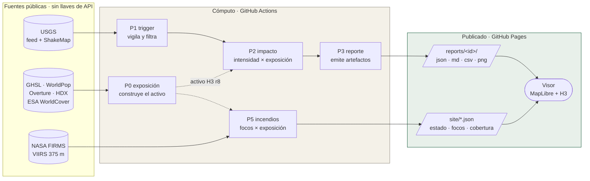

# Documentación de CENTINELA

Este directorio es el mapa del sistema. Está partido en dos: **documentación
por componente**, en carpetas, que explica cómo funciona cada pieza; y
**documentos transversales**, sueltos en la raíz, que explican cómo se opera,
qué garantiza y cómo se rompe.

## Por componente

| Carpeta | Qué explica |
|---|---|
| [`arquitectura/`](arquitectura/) | La vista de conjunto, el viaje del dato de punta a punta y el contrato de cada fichero |
| [`acciones/`](acciones/) | Las doce GitHub Actions: quién dispara a quién, con qué reloj y por qué |
| [`pipelines/`](pipelines/) | Los seis pipelines de Python: qué extrae, qué calcula y qué escribe cada uno |
| [`datos/`](datos/) | Las fuentes, sus licencias, las agregaciones y el esquema del activo |
| [`visor/`](visor/) | El visor estático: qué consume, cómo pinta y cómo se validan sus capas |

## Transversales

| Documento | Para qué |
|---|---|
| [`OPERACION.md`](OPERACION.md) | Qué vigilar ahora que el sistema opera |
| [`GARANTIAS.md`](GARANTIAS.md) | Qué garantiza el sistema y qué explícitamente no |
| [`FAMILIAS_DE_FALLO.md`](FAMILIAS_DE_FALLO.md) | Siete formas de romperlo sin que nada se ponga rojo |
| [`PUESTA_EN_MARCHA.md`](PUESTA_EN_MARCHA.md) | Levantar el proyecto desde cero |
| [`PUBLICAR_ACTIVO.md`](PUBLICAR_ACTIVO.md) | Cómo se publica el activo y por qué no va en git |
| [`AUDITORIA.md`](AUDITORIA.md) | La auditoría del 25-ago-2026 y su cierre |
| [`CLEAN_CODE.md`](CLEAN_CODE.md) | Las reglas de código, con el caso real que motivó cada una |
| [`PARA_INSTITUCIONES.md`](PARA_INSTITUCIONES.md) | Qué ofrece el sistema a una entidad de gestión del riesgo |

Fuera de `docs/`: [`ESPECIFICACION.md`](../ESPECIFICACION.md) es la especificación
técnica (v0.10) y manda sobre todo lo demás; [`PENDIENTES.md`](../PENDIENTES.md)
es la deuda viva.

## El sistema en un vistazo

**El principio que ordena todo lo demás:** el activo de exposición es
*agnóstico a la amenaza*. Las mismas celdas H3 cuentan gente bajo MMI 7 y gente
bajo fuego activo. Por eso P2 y P5 son hermanos, no primos lejanos: cambian la
amenaza, comparten el denominador.
