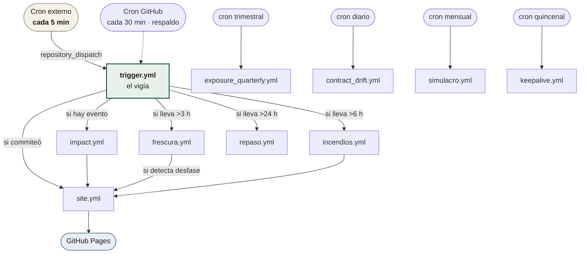

# GitHub Actions

Trece workflows. Tres son el camino crítico de un sismo, seis son
mantenimiento periódico, dos son verificación de código y dos se disparan a
mano.

| Documento | Qué explica |
|---|---|
| [`orquestacion.md`](orquestacion.md) | Quién dispara a quién y con qué reloj |
| [`el-vigia.md`](el-vigia.md) | `trigger.yml` en detalle, y el cron externo que lo acelera |
| [`cadena-de-evento.md`](cadena-de-evento.md) | `impact.yml` y `site.yml`: de un `usgs_id` a la página publicada |
| [`mantenimiento.md`](mantenimiento.md) | Frescura, keepalive, simulacro, deriva de contrato y CI |

## Las doce, de un vistazo

| Workflow | Disparo | Qué hace |
|---|---|---|
| `trigger.yml` | `repository_dispatch` (5 min) + cron 30 min | **El vigía.** Revisa el feed de USGS, publica latido y observados |
| `impact.yml` | `repository_dispatch: centinela-evento` + manual | P2 + P3: calcula el impacto y emite el reporte |
| `site.yml` | push a `site/` o `reports/` + manual | Publica el visor en GitHub Pages |
| `incendios.yml` | cron cada 6 h | P5: focos activos de FIRMS |
| `frescura.yml` | cron cada 3 h | ¿La página publicada va al día con el repositorio? |
| `repaso.yml` | cron diario | RF-04 más allá del feed: eventos con versión de producto más nueva |
| `exposure_quarterly.yml` | cron trimestral | P0: reconstruye el activo de exposición |
| `rezago.yml` | cron semanal (lunes) | ¿Algún reporte publicado se quedó atrás de sus fuentes? Informa, no despacha |
| `contract_drift.yml` | cron diario 08:00 UTC | ¿Cambiaron los contratos de las fuentes? |
| `simulacro.yml` | cron mensual, día 5 | Ensayo en seco de la cadena completa |
| `keepalive.yml` | cron días 1 y 15 | Impide que GitHub desactive los crons por inactividad |
| `ci.yml` | push y PR | ruff + mypy + suite de pruebas |
| `visor.yml` | push y PR | Playwright: el visor abierto en un navegador de verdad |
| `contraste.yml` | manual | Fase 2: contraste con evaluación de daño externa |

## El reloj completo

**El vigía es el reloj de todo lo demás.** Es un patrón deliberado: en vez de
confiar en que GitHub honre siete crons distintos —no lo hace—, el vigía corre
seguido y despierta a los otros cuando les toca por edad. Así, acelerar el
vigía acelera al sistema entero.

## Por qué no se confía en el cron de GitHub

GitHub concede los crons programados en función de la carga de la plataforma.
Medido sobre 26 revisiones reales de este repositorio:

| | Declarado | Real |
|---|---|---|
| Mediana entre revisiones | 30 min | **165,9 min** |
| p90 | — | 484,4 min |
| Peor caso | — | **765,9 min** (12,8 h) |

Esas cifras las publica el propio sistema en `site/status.json` → `cadencia`.
El cron externo por `repository_dispatch` es la respuesta, y está documentado
en [`el-vigia.md`](el-vigia.md).
