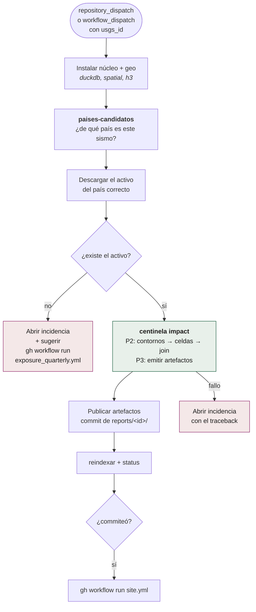
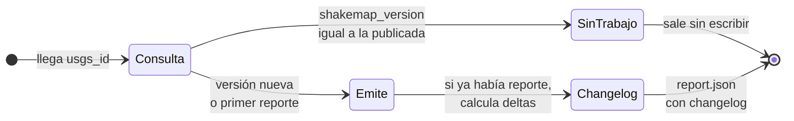
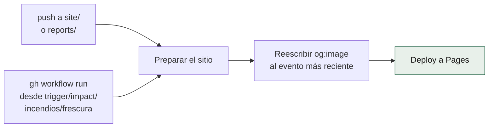

# La cadena de un evento: `impact.yml` y `site.yml`

De un `usgs_id` a una página publicada. Es el camino crítico: lo que el
objetivo de latencia (p50 60 min, p95 90 min) mide de punta a punta.

## `impact.yml`: P2 + P3

### El enrutado al país

Un sismo no trae su país en el feed. `centinela paises-candidatos` lo resuelve
desde el detalle de USGS y devuelve una lista ordenada de ISO3 candidatos,
porque un epicentro en el mar, o a 20 km de una frontera, puede afectar a dos
países. El workflow prueba en orden y **reintenta** con el siguiente si el
activo del primero no existe.

Si ninguno tiene activo, no publica ceros: abre una incidencia diciendo qué
país falta y cómo construirlo.

### Idempotencia por versión de producto

Correr `impact.yml` dos veces sobre el mismo evento y la misma versión de
ShakeMap **no produce trabajo**. Cuando USGS publica v(n+1), sí re-emite, y el
`report.json` incluye un `changelog` con las diferencias contra la versión
anterior: cuánta población entró o salió de cada banda.

### El reporte preliminar

Si el sismo pasó el filtro pero **ShakeMap todavía no existe** (lo normal en
los primeros minutos), P2 no espera de brazos cruzados. Emite un reporte
preliminar por radios fijos (25, 50 y 100 km) y reintenta cada 30 minutos
durante un máximo de 6 horas. El estado del evento queda en `preliminar` y el
reporte lo declara.

## `site.yml`: la publicación

### Por qué todos los workflows lo llaman a mano

Un push hecho con `GITHUB_TOKEN` **no dispara otros workflows**. Es una
protección de GitHub contra bucles infinitos, y es correcta, pero significa
que commitear `site/status.json` desde el vigía no republica la página.

El 26-ago-2026 eso dejó el visor **diecisiete horas sirviendo datos viejos con
los dos workflows en verde**. Por eso cada workflow que commitea algo publicable
termina con un `gh workflow run site.yml` explícito, condicionado a que
realmente haya commiteado.

Y por eso además existe `frescura.yml`, que compara la página publicada con el
repositorio cada 3 horas: la red de seguridad de esta misma clase de fallo.
Ver [`mantenimiento.md`](mantenimiento.md).
