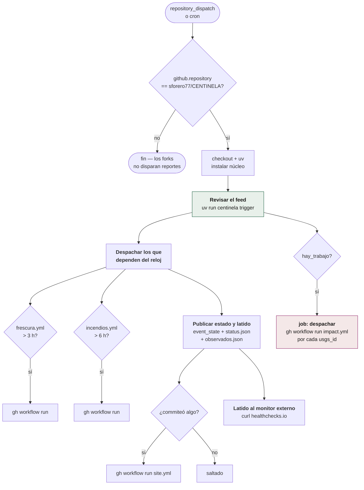
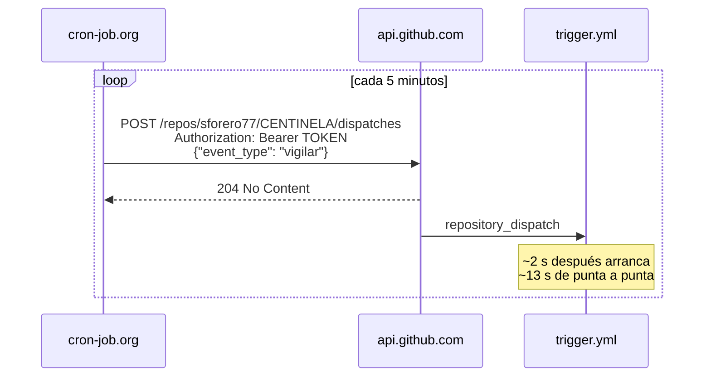

# El vigía — `trigger.yml`

El workflow más largo del repositorio (350 líneas) y el único que corre
siempre. Hace cuatro cosas: revisa el feed, despierta a los demás, publica el
latido y avisa al monitor externo.

## Anatomía de una corrida



## Las tres decisiones que este workflow documenta en su propio código

### 1. El latido se publica siempre, no sólo cuando hay evento

El paso *Publicar estado y latido* **no lleva condición de `hay_trabajo`**, y es
deliberado. La llevaba, y el latido nunca llegaba a publicarse:

> La ausencia de latidos es la señal de que el cron se desactivó, que es el
> modo de falla más probable de todo el sistema. Pero el commit sólo ocurría
> cuando había evento. O sea que **el único caso que el latido vigila era justo
> el caso en que no se publicaba**: tras 20+ corridas verdes, `site/status.json`
> seguía con `"latidos": []`.

### 2. El latido se frena a uno por hora

Un latido por corrida serían ~36 commits al día con el cron interno, y **288
con el externo**. `events/` es la base de datos del sistema y su historial tiene
que seguir siendo legible. Con evento se publica siempre; sin él, como mucho uno
por hora. Basta uno cada hora para responder "el cron sigue vivo".

### 3. Un fallo al despachar no puede tumbar al vigía

```bash
gh workflow run "$workflow" || echo "::warning::no se pudo despachar $workflow"
```

Su trabajo —revisar el feed y commitear— ya está hecho. Se avisa y se sigue.

## El cron externo



### Cómo se aprovisiona

1. **Token**: fine-grained PAT sobre `sforero77/CENTINELA` con el permiso
   **Contents: Read and write** — el único que la API de dispatches exige
   (lo confirma la cabecera `x-accepted-github-permissions: contents=write`).
2. **Servicio**: cron-job.org, Cloudflare Workers o equivalente, llamando cada
   5 minutos al endpoint de arriba.
3. **Respuesta esperada**: `204 No Content`, sin cuerpo.

### Lo que cuesta

| | |
|---|---|
| Corridas/día | 288 |
| Minutos de Actions | 62/día → ~1.872/mes |
| ¿Se cobran? | **No.** El repositorio es público, y en repos públicos los minutos son gratis e ilimitados |
| Llamadas a la API | 12/hora de 5.000 (0,24 % del límite) |
| Commits de latido | ≤24/día, por el freno horario |

> **En un repositorio privado esto no cabría**: 1.872 min/mes se comen casi
> entero el cupo gratuito de 2.000. Si el repo dejara de ser público, esta
> cadencia hay que reconsiderarla.

### El cron interno se queda

`schedule: */30 * * * *` sigue declarado a propósito. Si el servicio externo
cae, el vigía sigue corriendo mal pero corriendo, y eso es mejor que un único
punto de fallo fuera del repositorio. Y si el externo se para del todo, el
latido se detiene y **healthchecks.io avisa a los 30 minutos** — la misma
alarma que ya cubría la desactivación silenciosa del cron, sin nada nuevo.

## Qué produce cada corrida

```json
{"msg": "latido del trigger", "revisados": 14, "relevantes": 0,
 "observados": 2, "nuevos": [], "revisitados": []}
```

- **`revisados`** — candidatos leídos de los dos feeds, ya deduplicados.
- **`relevantes`** — los que pasaron el filtro (tipo, magnitud, bbox).
- **`observados`** — sismos de LATAM vistos y descartados por umbral. Se
  publican en `site/observados.json` con la razón: el vigía tiene que poder
  demostrar que estuvo mirando.
- **`nuevos` / `revisitados`** — lo que se despacha a P2.
