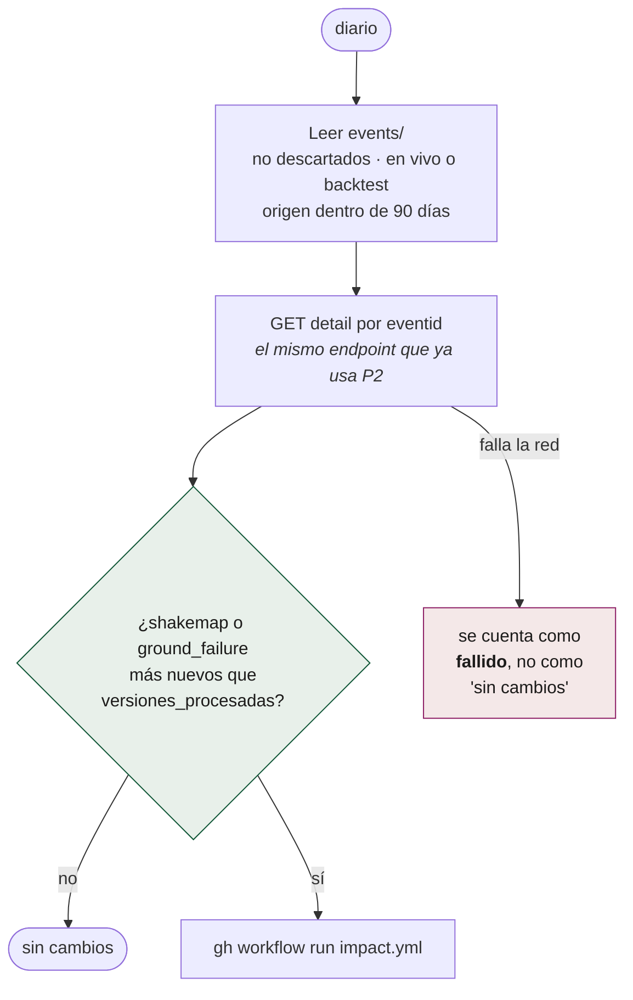
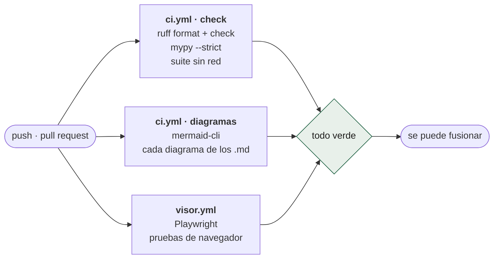

# Mantenimiento y verificación

Los workflows que no producen reportes: existen para que el sistema no se rompa
en silencio. Aquí está **por qué** cada uno está escrito como está; el diagrama
de lo que comprueba cada uno, paso a paso, está en
[`por-reloj.md`](por-reloj.md).

> Esta página abría con «Cinco workflows» y explicaba ocho, sin contar
> `rezago.yml`, que no estaba documentado en toda la carpeta. Una cuenta a mano
> vuelve a desincronizarse en cuanto entra un fichero, así que ya no hay cuenta
> aquí: la que se vigila con prueba es la de
> [`README.md`](README.md), y `tests/unit/test_relojes_documentados.py` exige
> además que cada workflow tenga su diagrama.

## `frescura.yml`: ¿la página va al día?

Cada 3 horas (y cuando el vigía la despierta), compara el `generado_utc` de la
página **publicada** contra el del repositorio.

**Qué vigila y qué no.** Detecta que el repositorio avanza y la página no. Si
el vigía se muriera, los dos se quedarían quietos a la vez y esto no diría
nada: de eso se ocupa el latido a healthchecks.io, que es un vigilante
distinto para un fallo distinto. Mezclarlos daría una alarma incapaz de decir
cuál de las dos cosas se rompió.

**Y no poder mirar no es estar al día.** Un 404 en un fichero recién nacido es
normal (el primer despliegue no ha corrido) y confundir «la red se cayó» con «la
página está vieja» manda a investigar mal, así que un fallo suelto se anota y se
sigue. Pero si no se pudo comparar **ninguno**, la comprobación no llegó a
correr, y el comando sale con código 1. Estuvo saliendo en verde hasta el
31-ago-2026: el vigilante que existe porque el visor pasó diecisiete horas
congelado con todo en verde se apuntaba un verde estando ciego.

La deduplicación de incidencias y el auto-cierre existen porque una alarma que
abre una incidencia cada 3 horas deja de leerse a la semana.

## `repaso.yml`: RF-04 más allá de las 24 h del feed

Diario (y cuando el vigía lo despierta). Pregunta por los eventos de los
últimos **90 días** *por su identificador*, sin depender del feed, y despacha a
P2 los que tengan una versión de producto más nueva.

**Por qué existe.** El vigía cumple RF-04 mirando el feed, y `4.5_day` son 24
horas. Pasado un día el evento se cae de ahí y nadie vuelve a preguntar. Pero
las revisiones de ShakeMap duran mucho más: medido contra USGS sobre los veinte
eventos publicados, la mediana hasta la última revisión son **63 días**, y el de
Venezuela llegó a **v15 dos meses después** del sismo. Ninguno terminó dentro de
las 24 h del feed.

**Por qué 90 días.** Cubre 17 de los 20 medidos. Los tres que se salen (185, 571
y 2.024 días) no son revisiones del evento: son reprocesos del catálogo entero
que USGS hace cada varios años, y perseguirlos a diario sería gastar peticiones
en algo que no va a pasar hoy.

**Qué queda fuera:** solo `descartado`, que es terminal. Los backtests entran
desde el 8-sep-2026: se excluían por miedo a que re-emitirlos ensuciara el
catálogo, y la medición contra USGS de ese día dijo lo contrario mientras el
Chocó llevaba desde el 7-sep en ShakeMap v8 con USGS ya en v9. Lo que se sale de
la ventana lo re-emite `rezago.yml`.

**Y un fallo de red no es un «sin cambios»**, con la distinción que importa: si
falla **alguno**, se avisa y la corrida sigue (los que sí se consultaron valen y
sus despachos salen); si fallan **todos**, sale con código 1 y la corrida se pone
roja, porque eso no es «sin cambios» sino no haber repasado.

Y «no había nada que repasar» tampoco es «no se pudo repasar»: sin eventos en
los últimos noventa días, cero revisados con cero fallidos sale en verde.
Confundirlo pondría el workflow en rojo sin motivo.

## `keepalive.yml`: que GitHub no apague los crons

Días 1 y 15, 07:00 UTC. GitHub **desactiva los workflows programados de repos
sin actividad durante 60 días**. Este workflow existe solo para que ese
contador no llegue nunca.

## `simulacro.yml`: los dos ensayos mensuales

Día 5, 09:00 UTC. Dos jobs, porque son dos mitades distintas de la cadena.

**`simulacro`** corre P1 **en seco** (`--dry-run`): el vigía revisa el feed de
verdad pero no escribe `event_state`. Prueba que las piezas siguen encajando sin
esperar a que haya un sismo.

> «Ni publica nada» decía aquí, y sí publica: `trigger --dry-run` recalcula y
> reescribe `site/status.json` —rota la ventana de latidos y recuenta
> `revisiones`— porque el latido es parte del estado del vigía, no del evento.
> En CI da igual (`persist-credentials: false`, nadie empuja), pero en local
> ensucia el árbol y hay que revertirlo a mano.

**`poblacion`** ensaya la otra mitad, la que el ensayo en seco no toca: el join
contra el activo, el ranking municipal, el CSV, los mapas y la validación contra
el esquema. Baja el activo de COL del Release, coge el ShakeMap real del Chocó,
lo **muda sobre Cali** con
[`scripts/simulacro_sismo.py`](../../scripts/simulacro_sismo.py) y exige que
alcance un millón de personas en MMI≥6. Después comprueba que el árbol
publicado quedó intacto.

El mínimo de un millón no es decorativo: un simulacro que sale en ceros no
ensayó nada, y salir en ceros es exactamente lo que ya pasaba solo — los dos
eventos que P1 despachó el 2-sep cayeron mar adentro.

Cada job abre su incidencia si falla y la cierra solo el mes que vuelve a salir
bien.

## `rezago.yml`: ¿lo publicado sigue siendo cierto?

Lunes, 07:23 UTC. Es el reverso de `repaso.yml`: aquel pregunta por los
**eventos**, este por los **reportes que ya están publicados**. ¿Lo que la
página sirve hoy sigue coincidiendo con lo que sus fuentes dicen hoy?

Cubre lo que el repaso no ve: un ShakeMap que USGS revisa pasados los noventa
días y un cambio en la receta del activo de un país. **Todo lo que encuentra lo
re-emite solo** desde el 13-sep-2026. Hasta entonces informaba y una persona
decidía, porque re-emitir movía cifras que el README citaba a mano; ese día el
README dejó de publicar cifras. Lo único que abre incidencia es un reporte cuyo
producto ya no está en USGS, porque re-emitirlo no lo arregla.

**Que haya rezago no es un fallo y el comando sale con 0 a propósito.** Es
trabajo que el paso siguiente despacha. Lo que sí sale con 1 es no haber podido
consultar ninguno: eso no es «no hay rezago», es estar ciego.

## `contract_drift.yml`: ¿cambiaron las fuentes?

Diario, 08:00 UTC. Las fuentes públicas cambian sus formatos sin avisar. Este
workflow valida los contratos de USGS —el feed resumen y **desde el 6-sep-2026
también los productos del detail**— contra
[`schemas/usgs/`](../../schemas/usgs/), más el release de Overture y las cajas
de los países, y falla si algo derivó. Abre una incidencia, comenta en ella
mientras siga derivando y la cierra sola cuando las fuentes vuelven a cumplir.

> Este párrafo decía que validaba «feed y productos de detalle» desde antes de
> que existiera la prueba que lo hace: `grep -rn "detail-products"` sobre todo
> el repositorio devolvía **una** coincidencia, su propio `$id`. Ningún test,
> ningún módulo y ningún workflow lo cargaban, así que no es que se validara
> contra fixtures congeladas: no se validaba contra nada, nunca. Y si se hubiera
> ejecutado no habría atrapado nada, porque el esquema no tenía un solo
> `required` dentro de `products` — comprobado: `{"products": {}}` lo pasaba.
> Ahora exige `status`, `preferredWeight`, `updateTime`, `contents` y
> `properties.version` por entrada, y al menos un contenido con su `url`.

Es la diferencia entre enterarse el día que cambia y enterarse el día que hay
un sismo.

## `ci.yml` y `visor.yml`: las dos verificaciones

`visor.yml` no es opcional ni decorativo: abre el visor en un Chromium de
verdad y comprueba cosas que ninguna prueba unitaria ve: que las pestañas
reciben el clic, que ningún texto se pisa con otro en los tres tamaños de
pantalla, que la leyenda promete lo que el mapa dibuja.

Su instrumentación es `window.CENTINELA.pintado`, un registro público de qué
capas se pintaron y con cuántos rasgos. Las pruebas leen de ahí, no de una
captura de pantalla.

El job `diagramas` compila con `mermaid-cli` cada bloque Mermaid de los `.md`
versionados, los de esta página incluidos. Un diagrama roto no rompe nada que
la suite vea: GitHub lo publica como un recuadro de error donde tenía que estar
la explicación. El 12-sep-2026 el `timeline` de [`por-reloj.md`](por-reloj.md)
se leía bien y no compilaba, y se vio sólo porque se compiló a mano. Va en
`ci.yml` y no en `visor.yml`, que ya instala Chromium, porque aquel no se
dispara con un cambio en `docs/`.

## `exposure_quarterly.yml`: la reconstrucción del activo

Trimestral (1 de enero, abril, julio y octubre, 06:00 UTC), y a mano con
`-f iso3=XXX` cuando falta un país. Reconstruye el activo de exposición desde
las fuentes originales. Ver [`../pipelines/p0-exposicion.md`](../pipelines/p0-exposicion.md).
