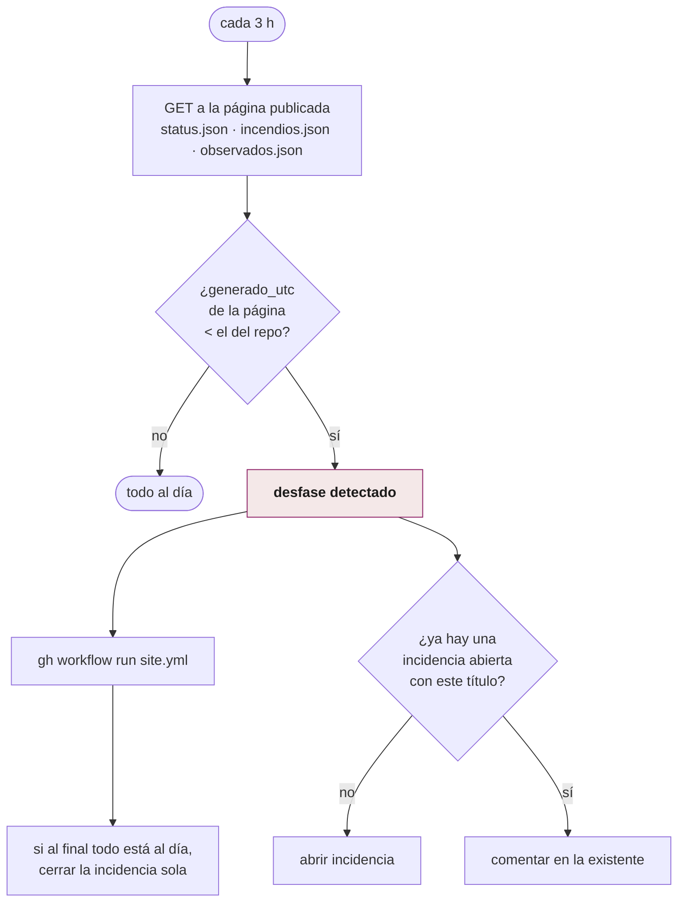
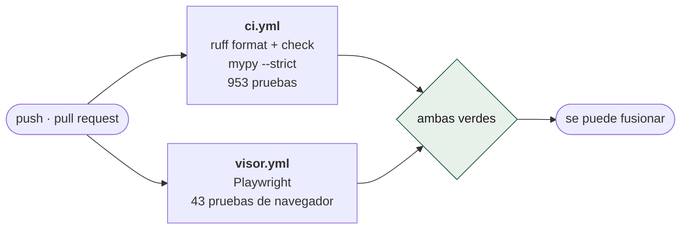

# Mantenimiento y verificación

Cinco workflows que no producen reportes: existen para que el sistema no se
rompa en silencio.

## `frescura.yml` — ¿la página va al día?

Cada 3 horas (y cuando el vigía la despierta), compara el `generado_utc` de la
página **publicada** contra el del repositorio.

**Qué vigila y qué no.** Detecta que el repositorio avanza y la página no. Si
el vigía se muriera, los dos se quedarían quietos a la vez y esto no diría
nada — de eso se ocupa el latido a healthchecks.io, que es un vigilante
distinto para un fallo distinto. Mezclarlos daría una alarma incapaz de decir
cuál de las dos cosas se rompió.

La deduplicación de incidencias y el auto-cierre existen porque una alarma que
abre una incidencia cada 3 horas deja de leerse a la semana.

## `keepalive.yml` — que GitHub no apague los crons

Días 1 y 15, 07:00 UTC. GitHub **desactiva los workflows programados de repos
sin actividad durante 60 días**. Este workflow existe sólo para que ese
contador no llegue nunca.

## `simulacro.yml` — el ensayo mensual

Día 5, 09:00 UTC. Corre la cadena completa **en seco** (`--dry-run`): el vigía
revisa el feed de verdad pero no escribe `event_state` ni publica nada. Prueba
que las piezas siguen encajando sin esperar a que haya un sismo.

## `contract_drift.yml` — ¿cambiaron las fuentes?

Diario, 08:00 UTC. Las fuentes públicas cambian sus formatos sin avisar. Este
workflow valida los contratos de USGS (feed y productos de detalle) contra
[`schemas/usgs/`](../../schemas/usgs/) y falla si el esquema derivó.

Es la diferencia entre enterarse el día que cambia y enterarse el día que hay
un sismo.

## `ci.yml` y `visor.yml` — las dos verificaciones

`visor.yml` no es opcional ni decorativo: abre el visor en un Chromium de
verdad y comprueba cosas que ninguna prueba unitaria ve — que las pestañas
reciben el clic, que ningún texto se pisa con otro en los tres tamaños de
pantalla, que la leyenda promete lo que el mapa dibuja.

Su instrumentación es `window.CENTINELA.pintado`, un registro público de qué
capas se pintaron y con cuántos rasgos. Las pruebas leen de ahí, no de una
captura de pantalla.

## `exposure_quarterly.yml` — la reconstrucción del activo

Trimestral (1 de enero, abril, julio y octubre, 06:00 UTC), y a mano con
`-f iso3=XXX` cuando falta un país. Reconstruye el activo de exposición desde
las fuentes originales. Ver [`../pipelines/p0-exposicion.md`](../pipelines/p0-exposicion.md).
