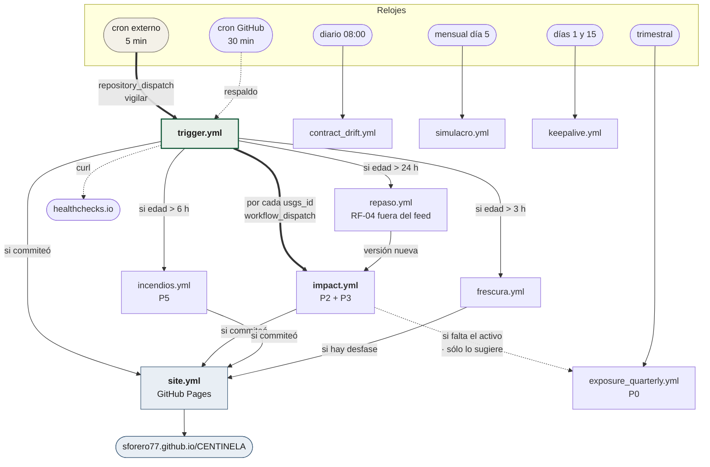
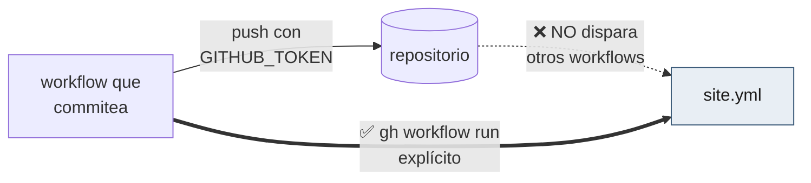

# Orquestación

Quién dispara a quién. La regla general: **el vigía es el reloj de todo lo
demás**, porque es lo único que corre lo bastante seguido como para ser un
reloj fiable.

## El grafo completo



## Los tres mecanismos de disparo

| Mecanismo | Quién lo usa | Por qué ese y no otro |
|---|---|---|
| `repository_dispatch` | el cron externo → `trigger.yml` | Es el único que un servicio de fuera puede invocar con un token, y **sólo corre sobre la rama por defecto**, que es donde vive el vigía |
| `gh workflow run` (`workflow_dispatch`) | vigía → impact, frescura, incendios, site | Permite pasar `inputs` (el `usgs_id`) y no depende de que haya push |
| `push` | site.yml, ci.yml, visor.yml | Reacciona a cambios de contenido, no de reloj |

### La trampa del `GITHUB_TOKEN`



GitHub bloquea la cascada de workflows desde un push hecho con el token
automático, para evitar bucles infinitos. Es la razón de que **todo workflow
que commitea algo publicable termine llamando a `site.yml` a mano**, y la
causa del incidente de las diecisiete horas del 26-ago-2026.

## El despacho por edad

El vigía no despierta a los demás en cada corrida: mira cuándo corrieron por
última vez.

```bash
despachar_si_toca frescura.yml  3   # cada 3 h
despachar_si_toca incendios.yml 6   # cada 6 h
despachar_si_toca repaso.yml   24   # diario
```

Con el cron externo a 5 minutos, esta comprobación ocurre 288 veces al día pero
sólo dispara 8 veces `incendios.yml` y 8 veces `frescura.yml`. La consulta de
edad es una llamada barata a `gh run list --limit 1`; el trabajo real sigue
gobernado por su propia cadencia.

## Qué pasa cuando algo falla

| Falla | Qué ocurre | Quién avisa |
|---|---|---|
| El cron externo se para | El cron interno de 30 min sigue; la cadencia empeora | healthchecks.io, a los 30 min sin latido |
| El vigía falla | No hay latido | healthchecks.io |
| `impact.yml` falla | Se abre una incidencia con el traceback | GitHub Issues |
| Falta el activo de un país | Incidencia diciendo qué construir | GitHub Issues |
| La página se queda atrás | `frescura.yml` republica y abre incidencia | GitHub Issues |
| Un contrato de fuente deriva | `contract_drift.yml` falla | el propio workflow |
| GitHub apaga los crons | `keepalive.yml` lo impide | — |

Ninguna de estas alarmas depende de que una persona mire la pantalla. Es la
regla que ordena el proyecto: **nada se da por arreglado si depende de que
alguien lo note**.
