# Cada reloj, de principio a fin

Los otros documentos de esta carpeta explican **por qué** cada workflow está
escrito como está: el latido que no se publicaba, las diecisiete horas del
visor congelado, la trampa del `GITHUB_TOKEN`. Este explica otra cosa, y es la
que hace falta a las tres de la mañana: **qué corre, qué comprueba, y qué pasa
cuando la comprobación dice que no**.

Un diagrama por disparador. Catorce workflows y nueve relojes.
Cada diagrama lleva sus puertas de decisión, sus códigos de salida y quién
recibe la alarma.

Las puertas rojas detienen o avisan; las verdes son el camino que publica.

## Los nueve relojes

| Reloj | UTC | Workflow | Qué comprueba | Si falla |
|---|---|---|---|---|
| `repository_dispatch` cada 5 min | continuo | `trigger.yml` | ¿Hay un sismo M≥5,5 en LATAM? | healthchecks.io a los 30 min sin latido |
| `*/30 * * * *` | cada 30 min | `trigger.yml` | Lo mismo, de respaldo | — |
| `17 */3 * * *` | cada 3 h | `frescura.yml` | ¿La página sirve lo que hay en el repo? | Republica e informa en una incidencia |
| `40 */6 * * *` | cada 6 h | `incendios.yml` | Focos VIIRS de las últimas 24 h | La corrida sale roja |
| `37 5 * * *` | 05:37 diario | `repaso.yml` | ¿Hay versión de producto más nueva a 90 días? | Código 1 si fallaron **todos** |
| `0 8 * * *` | 08:00 diario | `contract_drift.yml` | ¿Derivaron los contratos de las fuentes? | Incidencia automática |
| `23 7 * * 1` | lunes 07:23 | `rezago.yml` | ¿Algún reporte publicado quedó atrás? | Informa; rezago **no** es fallo |
| `0 9 5 * *` | día 5, 09:00 | `simulacro.yml` | Que el pipeline no se oxide entre catástrofes | Incidencia automática |
| `0 7 1,15 * *` | días 1 y 15 | `keepalive.yml` | Que GitHub no apague los crons | — |
| `0 6 1 1,4,7,10 *` | trimestral | `exposure_quarterly.yml` | Reconstruye el activo de cada país | Incidencia **por país** |

Y cinco disparadores que no son reloj: `impact.yml` y `site.yml` (los llama
otro workflow), `ci.yml` y `visor.yml` (push y PR), `contraste.yml` (a mano).

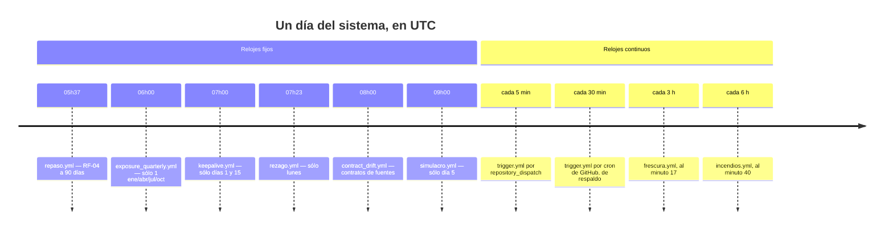

Las horas están repartidas a propósito y ninguna cae en punta: un cron a las
`0 0` compite con todos los repositorios del planeta y GitHub concede los
programados según carga. Ver [`el-vigia.md`](el-vigia.md).

---

## `trigger.yml` · el vigía

Cada 5 minutos por `repository_dispatch`, cada 30 por el cron de GitHub. Es el
único que corre siempre, y el reloj del que cuelgan otros tres.

El filtro de relevancia son **tres condiciones**, y las tres son la defensa
contra el riesgo número uno del proyecto: publicar una cifra alarmista por un
evento que no lo merecía.

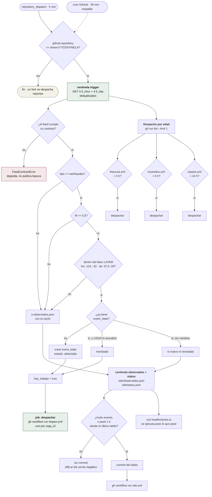

Un fallo al despachar **no tumba al vigía**: se avisa con `::warning::` y la
corrida sigue, porque su trabajo —revisar el feed y commitear— ya está hecho.
El porqué de cada una de esas decisiones está en [`el-vigia.md`](el-vigia.md).

---

## `impact.yml` · P2 y P3, el camino crítico

No tiene reloj: lo despacha el vigía, o `repaso.yml`, o `rezago.yml`, o una
persona. Es lo que mide el objetivo de latencia.

Su validación más rara es la del **país**: un sismo no trae el suyo en el feed,
las cajas envolventes se solapan y ordenarlas por área no basta —la de Chile
mide 1.719 grados cuadrados por Rapa Nui—, así que el desempate real lo da el
join y hay que poder reintentar con el candidato siguiente.

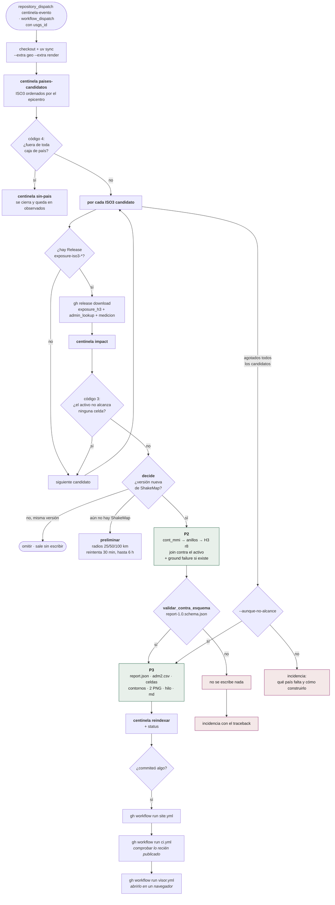

**Se comprueba a sí mismo después de publicar.** Los dos últimos pasos llaman a
`ci.yml` y a `visor.yml` sobre lo que se acaba de commitear: un `report.json`
fuera de contrato o un visor que no pinta se detectan en minutos y no el día
que alguien mire. El detalle del enrutado y de la idempotencia está en
[`cadena-de-evento.md`](cadena-de-evento.md).

---

## `site.yml` · la publicación

Push a `site/` o `reports/`, o `gh workflow run` desde cualquiera de los cuatro
workflows que commitean algo publicable.

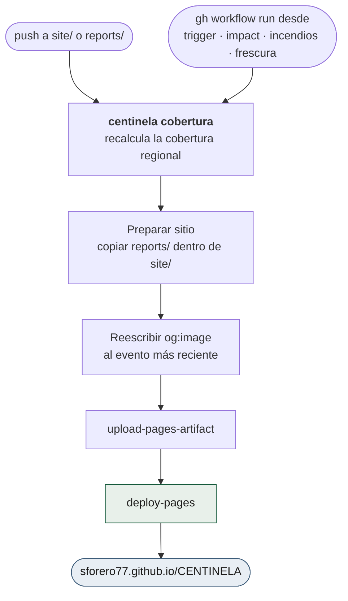

> **Un push hecho con `GITHUB_TOKEN` no dispara otros workflows.** Por eso todo
> el que commitea termina llamando a este a mano. Es la causa del incidente de
> las diecisiete horas y la razón de que exista `frescura.yml`.

---

## `frescura.yml` · cada 3 horas

Compara el `generado_utc` de la página **publicada** contra el del repositorio.
Es la red de seguridad del párrafo de arriba.

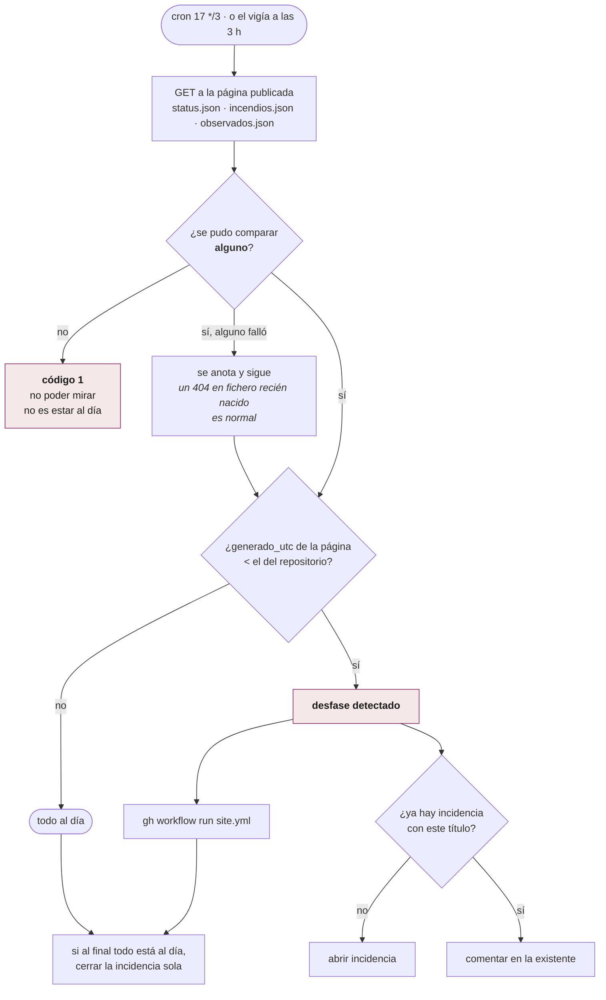

La deduplicación y el auto-cierre no son cortesía: una alarma que abre una
incidencia cada 3 horas deja de leerse a la semana.

---

## `incendios.yml` · cada 6 horas

P5. El mismo activo de exposición que usa P2, cruzado con los focos de calor de
las últimas 24 h.

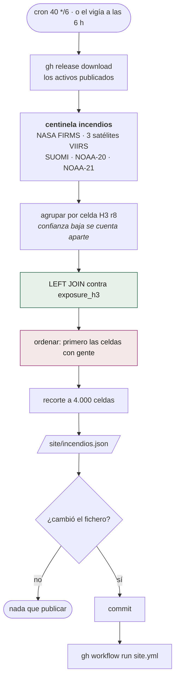

El recorte a 4.000 es lo que hace que la capa quepa en el visor. El orden por
población es lo que hace que el recorte no tire justo lo que importa.

---

## `repaso.yml` · diario, 05:37

RF-04 más allá de las 24 h del feed. Pregunta por identificador, no por feed:
la mediana hasta la última revisión de un ShakeMap son **63 días**.

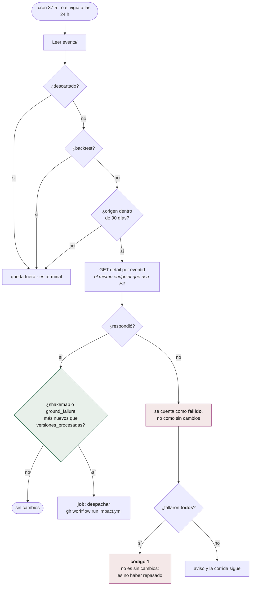

Cero revisados con cero fallidos **sale en verde**: hoy los eventos publicados
son casi todos backtests y quedan fuera por diseño. Confundir «no había nada que
repasar» con «no se pudo repasar» pondría el workflow en rojo todos los días.

---

## `contract_drift.yml` · diario, 08:00

Las fuentes públicas cambian de formato sin avisar. Este es el único workflow
cuyas pruebas **exigen red**: `pytest -m network`, que el resto de la suite
excluye por defecto.

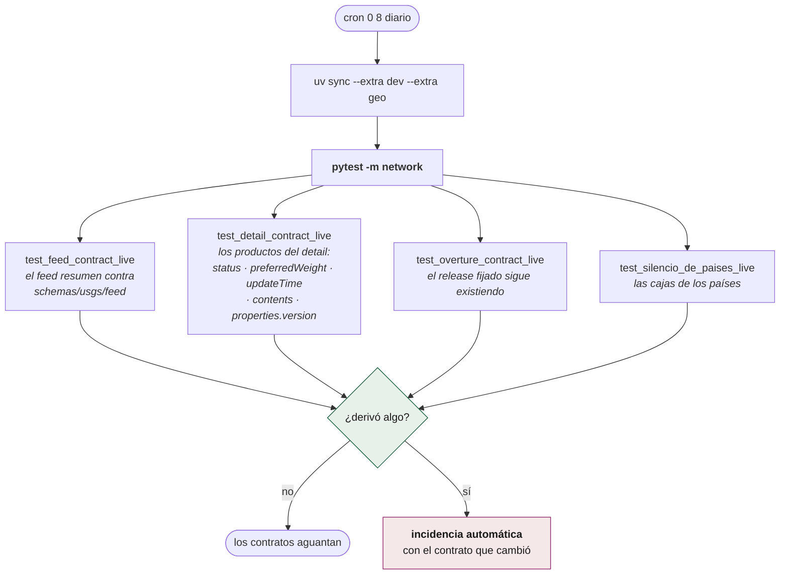

`test_overture_contract_live` es el que más caro sale ignorar: los manifests
fijan un release de Overture y Overture conserva **dos** —unos dos meses—.
Cuando ese release desaparece, el país no se puede reconstruir desde sus
propias fuentes. Es también la razón de que el trimestral reconstruya **todos**
los países publicados y no uno.

---

## `rezago.yml` · lunes, 07:23

Lo contrario de `repaso.yml`: en vez de preguntar por los eventos, pregunta por
los **reportes ya publicados**. ¿Lo que se está sirviendo sigue siendo lo que
las fuentes dicen hoy?

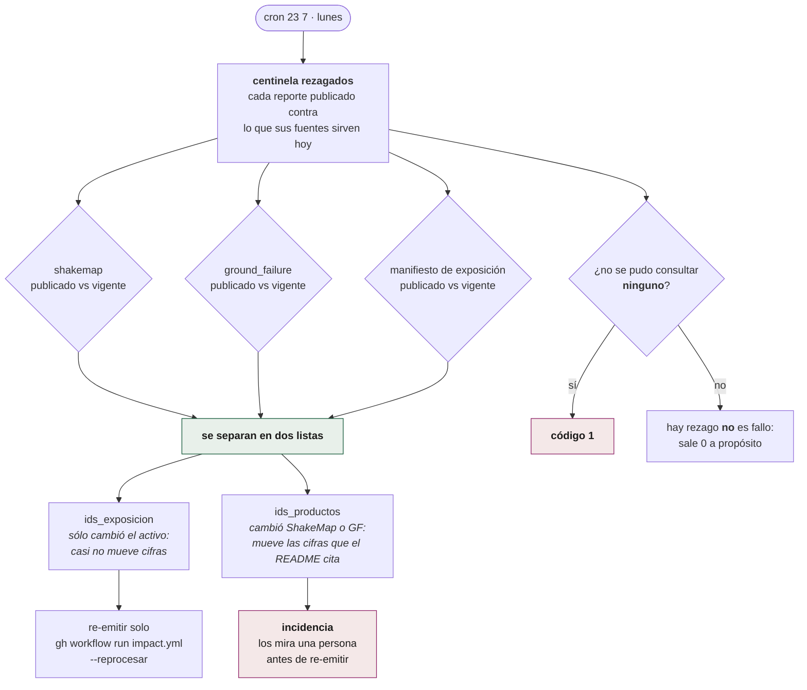

Que salga 0 cuando hay rezago es deliberado: convertir «hay trabajo pendiente»
en «algo se rompió» hace que en dos semanas nadie mire el aviso.

---

## `simulacro.yml` · día 5, 09:00

Dos jobs, porque el pipeline tiene dos mitades y se oxidan por separado.

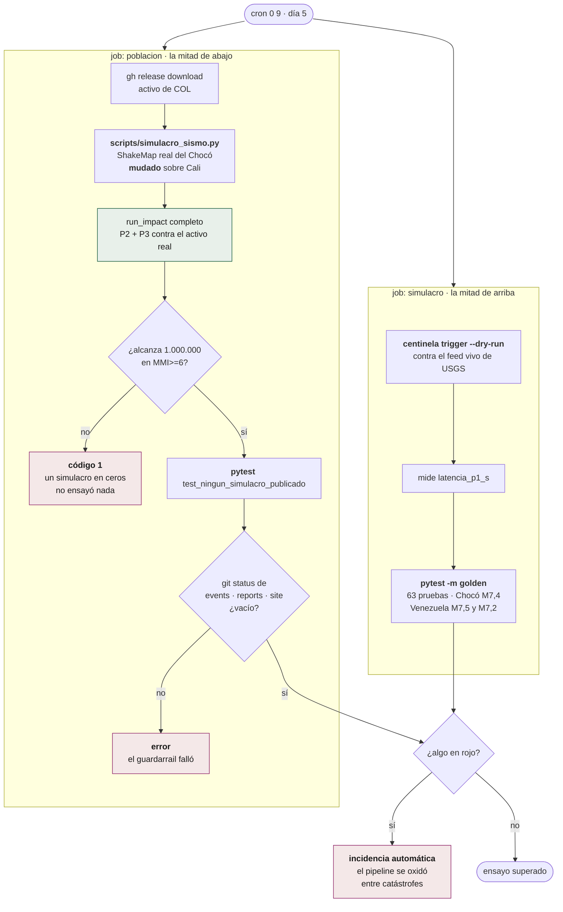

Ninguno de los dos jobs escribe estado ni publica nada, y los dos van con
`persist-credentials: false`: el checkout se queda sin token porque ninguno
necesita empujar. El segundo escribe en `work/simulacro/`, y hay dos cierres
independientes para que no pueda escribir en otro sitio — ver
[`mantenimiento.md`](mantenimiento.md) y
[`../../scripts/README.md`](../../scripts/README.md).

---

## `keepalive.yml` · días 1 y 15, 07:00

El workflow más corto del repositorio, y no es prescindible: **GitHub desactiva
los workflows programados de un repositorio sin actividad durante 60 días.**

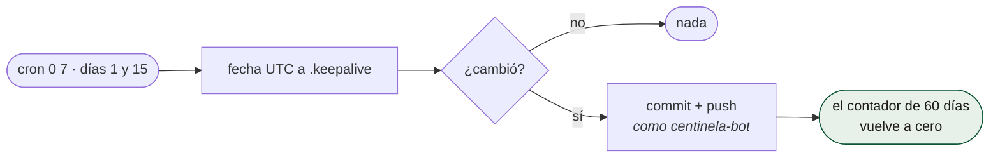

Si esto fallara callado, el sistema entero se apagaría sin una sola alarma: los
nueve relojes dejarían de sonar a la vez. Es el único caso que ninguna otra
comprobación cubriría, porque todas dependen de un cron.

---

## `exposure_quarterly.yml` · 1 de enero, abril, julio y octubre, 06:00

P0. El único que reconstruye el denominador de todo lo demás. Dos jobs: uno
decide qué países, otro los construye en paralelo de a cuatro.

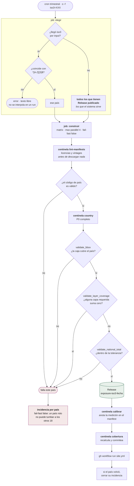

**Reconstruye todos los países publicados, no uno.** Lo hacía con uno, heredado
de cuando sólo existía Colombia, y eso dejaba diecisiete países a un trimestre
de quedarse sin camino de vuelta a sus fuentes: los manifests fijan un release
de Overture y Overture sólo conserva dos. Las tres validaciones internas están
en [`../pipelines/p0-exposicion.md`](../pipelines/p0-exposicion.md).

---

## `ci.yml` y `visor.yml` · push y pull request

No son relojes, son la puerta. Las dos tienen que estar verdes para fusionar, y
`impact.yml` las llama además **después de publicar**.

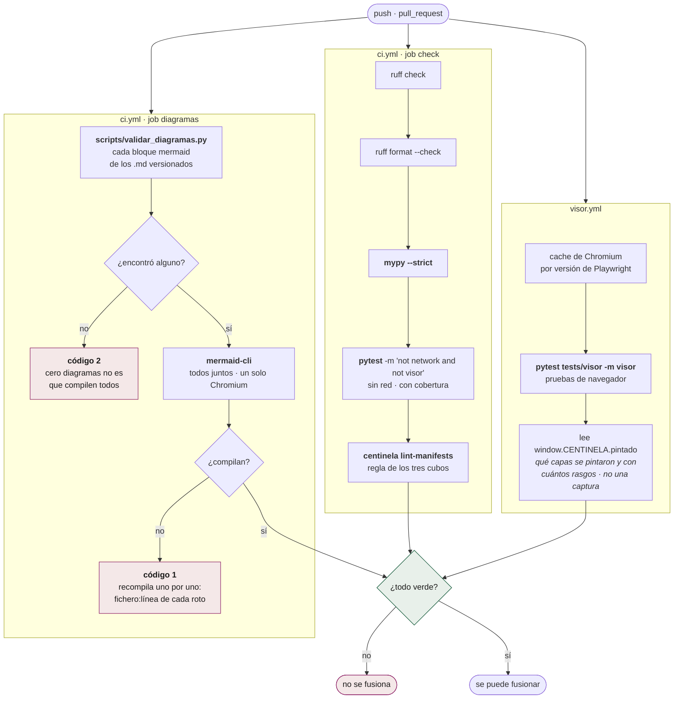

`visor.yml` comprueba lo que ninguna prueba unitaria ve: que las pestañas
reciben el clic, que ningún texto se pisa con otro en los tres tamaños de
pantalla, que la leyenda promete lo que el mapa dibuja.

El job `diagramas` comprueba lo que ninguna de las dos ve: que los diagramas de
la documentación, este incluido, se dibujan. Uno roto se publica en GitHub como
un recuadro de error. No va en `visor.yml`, aunque ya tenga Chromium, porque
aquel no se dispara con un cambio en `docs/`.

---

## `contraste.yml` · a mano

Fase 2. Es el único que compara las cifras del sistema contra una **evaluación
de daño externa**, que es la única manera de saber si el modelo de exposición
sirve para algo.

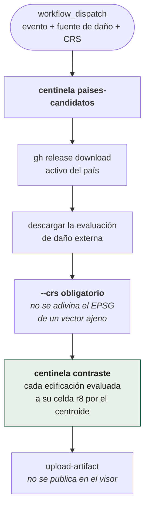

El resultado sube como artefacto de la corrida y **no** entra en la página: un
contraste es una medición del sistema, no un producto para quien responde a una
emergencia.

---

## Lo que ningún reloj cubre

| Fallo | Quién lo notaría |
|---|---|
| El cron externo se para | healthchecks.io, a los 30 min sin latido |
| GitHub desactiva los schedules | `keepalive.yml` lo impide; si fallara, **nadie** |
| Un sismo en vivo que alcance población | Nunca ha ocurrido. Lo ensaya `simulacro.yml` job `poblacion` |
| La página miente pero el repo también | `frescura.yml` compara los dos; si los dos se congelan a la vez, el latido |
| Una cifra publicada está mal | `rezago.yml` semanal, y el contraste de Fase 2 a mano |

**Nada se da por arreglado si depende de que alguien lo note.** Es la regla que
ordena el proyecto, y esta tabla es la lista de los sitios donde todavía no se
cumple del todo.
