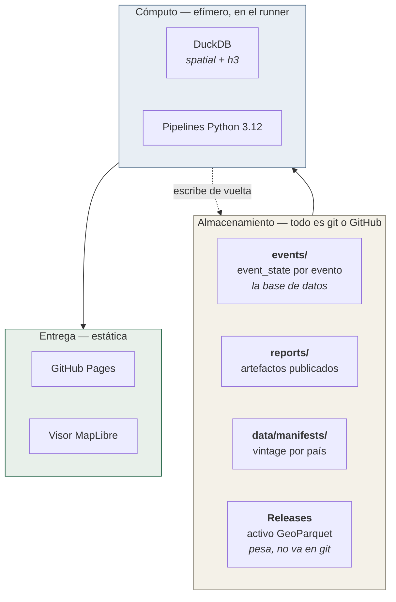

# Arquitectura

| Documento | Qué explica |
|---|---|
| [`flujo-de-datos.md`](flujo-de-datos.md) | El viaje del dato, de la fuente al píxel |
| [`contratos-de-datos.md`](contratos-de-datos.md) | Cada fichero publicado: quién lo escribe, quién lo lee, qué promete |
| [`decisiones.md`](decisiones.md) | Las decisiones de diseño que no se pueden cambiar sin cambiar el sistema |

## La forma del sistema

CENTINELA no tiene servidor, ni base de datos, ni credenciales de ningún
servicio. Eso no es austeridad: es la condición para que una comunidad pueda
mantenerlo sin presupuesto y para que cualquiera pueda reproducirlo.

### Las cuatro propiedades que se defienden

**1. Sin estado fuera de git.** `events/` es la base de datos del sistema y su
historial es legible. Por eso el latido del vigía se frena a uno por hora: 288
corridas al día no pueden ser 288 commits.

**2. Idempotencia por versión.** Correr P1 dos veces sobre el mismo feed no
crea trabajo duplicado. P2 sólo re-emite cuando aparece un ShakeMap v(n+1), y
entonces publica un *changelog* de deltas contra la versión anterior.

**3. El cero silencioso es un fallo.** Una capa que no se construye entraría
vacía al ensamblaje y el `LEFT JOIN` la volvería ceros. `validate_layer_coverage`
detiene el build si cualquier capa requerida suma cero en todo el país: es
preferible no publicar activo que publicar uno que informa cero donde no midió.

**4. Ninguna pieza correcta puede quedarse sin llamador.**
`tests/unit/test_funciones_conectadas.py` recorre el grafo de llamadas y falla
si una función pública no tiene quien la invoque. Existe porque el fallo más
repetido del proyecto no ha sido un cálculo malo sino una pieza probada que
nadie llamaba.

### Lo que hace un runner de GitHub Actions

Todo el trabajo pesado —polyfill H3, muestreo de ráster, joins de millones de
celdas— ocurre dentro de un runner gratuito, leyendo GeoParquet particionado
directamente con DuckDB. No hay warehouse ni cluster porque no hace falta:
la unidad de análisis es la celda y el particionado Hive (`iso3=/layer=`)
permite leer sólo el país que importa.
