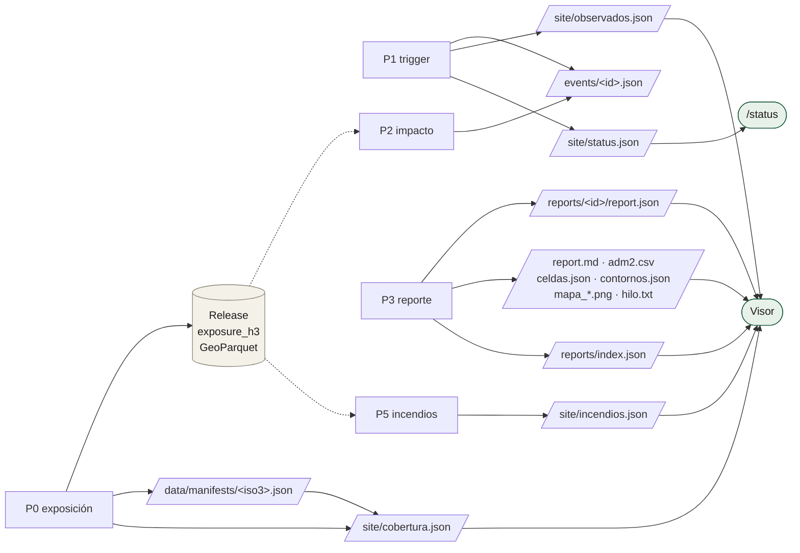
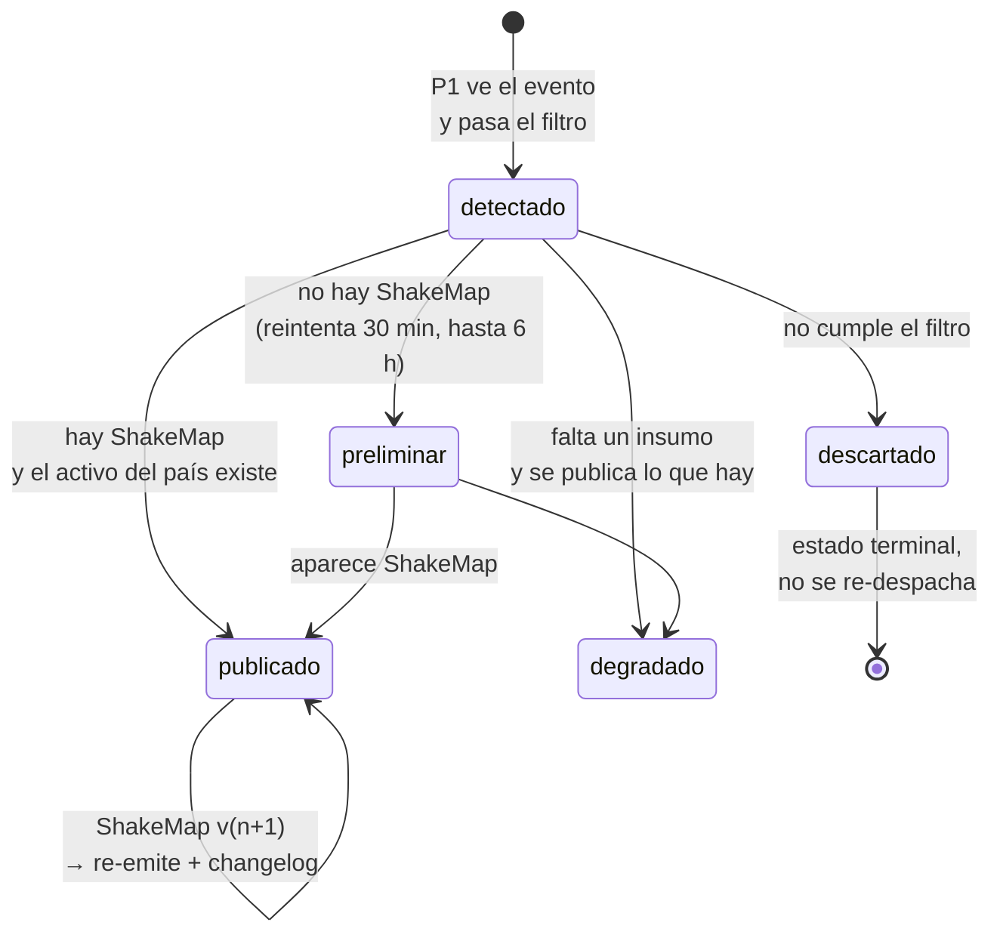

# Contratos de datos

Todo fichero publicado tiene un dueño que lo escribe y un consumidor que lo
lee. Esta tabla es el contrato: si cambia el productor sin cambiar el
consumidor, se rompe el visor en silencio.

## Mapa de escritura y lectura



## Los ficheros, uno por uno

### `events/<usgs_id>.json` — la base de datos

Escribe: **P1** (lo crea) y **P2** (avanza su estado).
Lee: **P1** para el dedupe, **P2** para saber si hay trabajo real.

Es la única persistencia del sistema y vive en git, así que su historial es
auditable. La máquina de estados:



Contrato formal: [`schemas/event-state.schema.json`](../../schemas/event-state.schema.json).

### `reports/<usgs_id>/` — los artefactos de un evento

| Fichero | Qué es | Quién lo consume |
|---|---|---|
| `report.json` | El reporte completo, validado contra esquema | visor, terceros |
| `report.md` | El mismo reporte en prosa española | humanos |
| `adm2.csv` | Una fila por municipio alcanzado | visor (tabla), analistas |
| `celdas.json` | La malla H3 del evento con sus columnas | visor (coropletas) |
| `contornos.json` | Los contornos MMI de ShakeMap | visor (líneas) |
| `mapa_general.png` | Mapa de intensidad | prensa |
| `mapa_prensa.png` | Variante para redes | prensa |
| `hilo.txt` | El hilo listo para publicar | el único paso manual del sistema |

`report.json` sigue [`schemas/report-1.0.schema.json`](../../schemas/report-1.0.schema.json)
y sus claves raíz son: `schema`, `event`, `inputs`, `preliminar`, `radios`,
`backtest`, `totales`, `top_municipios`, `incertidumbre`, `descargas`,
`changelog`, `disclaimers`, `generado_utc`, `pipeline_version`.

### `reports/index.json` — el catálogo

Una lista de 21 entradas, cada una con `usgs_id`, `mag`, `lugar`, `iso3`,
`lon`, `lat`, `pop_mmi7p`, `pop_mmi6p`, `utc`, `shakemap_version`,
`preliminar`, `backtest`, `generado_utc`. Es lo primero que descarga el visor.

### `site/observados.json` — la prueba de que el vigía miró

```
{ schema, generado_utc, ventana_dias: 5, nota, eventos: [
    { usgs_id, mag, lon, lat, depth_km, lugar, origen_utc, razon }
] }
```

Sismos de LATAM **vistos y no despachados** por quedar bajo el umbral. No se
despachan, pero se publican: el vigía tiene que poder demostrar que estuvo
mirando. El campo `razon` dice por qué no pasó — `"M4.7 < umbral M5.5"`.

### `site/incendios.json` — los focos activos

```
{ schema, generado_utc, ventana_horas: 24, nota, suelo, totales, celdas: [...] }
```

`totales` trae `celdas`, `celdas_publicadas`, `detecciones`, `detecciones_baja`,
`celdas_con_poblacion`, `pop_en_celdas_con_fuego`, `salud_…`, `edu_…`, `bld_…`,
`frp_total_mw`. `suelo` trae el reparto por clase de cobertura **más
`celdas_medidas` y `celdas_sin_medir`**, porque un porcentaje sin denominador
es una afirmación sin respaldo.

La `nota` no es decorativa: es la única línea que impide leer "detecciones"
como "incendios" y "celda con fuego" como "hectáreas quemadas".

### `site/cobertura.json` — qué países puede atender el sistema

```
{ generado_utc, resumen: { paises_con_manifest, paises_construidos,
  poblacion_en_la_malla, peor_desvio_pct }, paises: [...] }
```

Sale de los manifests, así que **no puede prometer más países de los que se
construyeron de verdad**. Cada país trae su `desvio_pct` contra la cifra
oficial de referencia y la `tolerancia_pct` que se le exige.

### `site/status.json` — la página de estado

```
{ generado_utc, objetivo, medido, eventos, cadencia, latidos, nota }
```

- `objetivo`: lo que el sistema promete (p50 60 min, p95 90 min).
- `medido`: lo que ha cumplido de verdad. `p50_min` es `null` hasta el primer
  evento en vivo; los 21 backtests se cuentan aparte en `backtests_excluidos`
  y no se mezclan con la medición real.
- `cadencia`: cada cuánto revisa el vigía, medido, con `declarado_min`,
  `p50_min`, `p90_min` y `peor_min`.
- `latidos`: la prueba de que el cron sigue vivo.

## La regla que sostiene todos estos contratos

Cada JSON publicado lleva **`generado_utc` en la raíz**. `pipelines/common/frescura.py`
lo lee de la página *publicada* y lo compara con el repositorio para detectar
que uno avanza y la otra no. Esa comprobación existe porque el 26-ago-2026 el
visor estuvo diecisiete horas sirviendo datos viejos con todo en verde.
