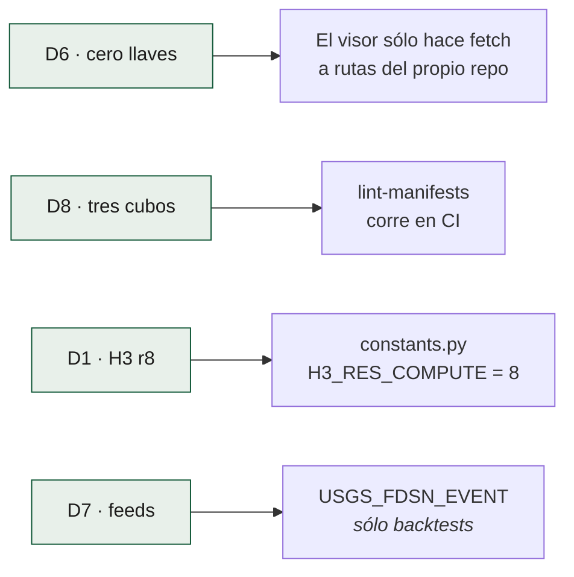
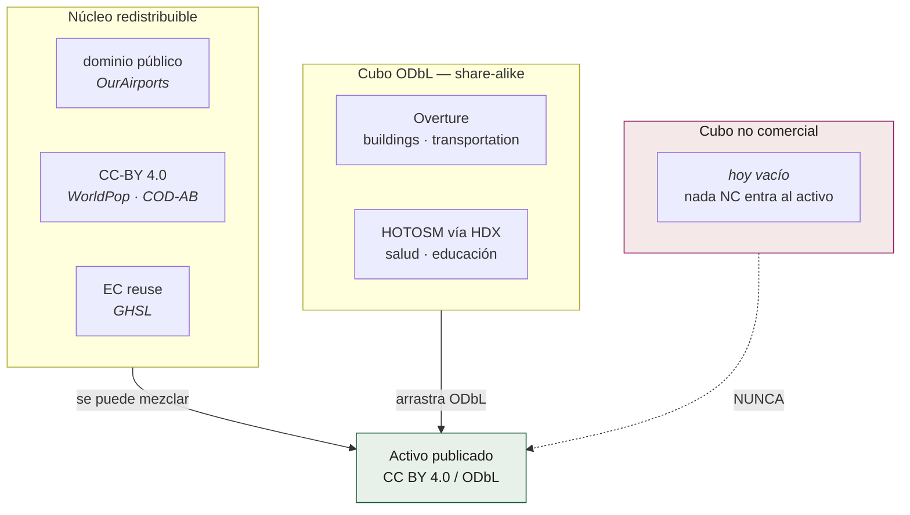

# Decisiones de diseño

Estas ocho decisiones vienen de [`ESPECIFICACION.md`](../../ESPECIFICACION.md) §2.
No son parámetros ajustables: cambiar una cambia el comportamiento publicado
del sistema y obliga a actualizar los golden tests.

| # | Decisión | Elegido | Descartado, y por qué |
|---|---|---|---|
| **D1** | Unidad de análisis | H3 r8 para cómputo, r7/r6 agregados para el visor, más crosswalk a división político-administrativa | Sólo municipios (pierde el detalle intraurbano); grid propio (no interoperable) |
| **D2** | Formato | GeoParquet particionado + PMTiles | PostGIS: exige un servidor vivo, o sea costo y mantenimiento |
| **D3** | Cómputo | DuckDB con extensiones `spatial` y `h3`, dentro del runner | Spark/Sedona (sobredimensionado); Google Earth Engine (dependencia de cuenta y de sus términos) |
| **D4** | Orquestación | GitHub Actions + `workflow_dispatch` + keepalive | Servidor propio. **La espec ya documentaba el camino al cron externo**, que es el que hoy da los 5 minutos |
| **D5** | Publicación | GitHub Releases + Pages | Servidor de mapas dinámico |
| **D6** | Visor | Estático: MapLibre GL JS, **cero llaves de API** | Visor con backend: una comunidad no puede sostener un SLA |
| **D7** | Disparo | Feeds GeoJSON en tiempo real de USGS | Polling a FDSN, que el propio USGS desaconseja para apps automatizadas |
| **D8** | Licencias | Núcleo redistribuible separado *físicamente* de derivados no comerciales | Mezclar: contaminaría el dataset y bloquearía el reuso |

## Cómo se hacen cumplir

Los valores viven en `pipelines/common/constants.py`, con esta advertencia en
su docstring: *"Todo valor aquí es una decisión de diseño citada, no un
parámetro ajustable al vuelo"*.

## La regla de los tres cubos (D8)

`pipelines/common/licensing.py` implementa `bucket_for(licencia)` y el lint de
manifests falla en CI si una capa entra en el cubo equivocado. El caso concreto
que esto bloquea: **Major TOM** (ESA Phi-lab, CC-BY-SA) no puede entrar al
activo porque arrastraría el share-alike al cubo entero; **AlphaEarth**
(Google DeepMind, CC-BY) sí podría. La decisión ya está tomada y es de
licencia, no de calidad.

## Decisiones abiertas

Estas no están cerradas y viven en [`PENDIENTES.md`](../../PENDIENTES.md):

- **MapLibre y h3-js vienen de unpkg sin `integrity`.** Vendorizarlos son ~800 KB
  en el repo a cambio de eliminar una dependencia de terceros en tiempo de
  ejecución. Contradice parcialmente el espíritu de D6.
- **Coropletas r7/r6 en PMTiles**: declaradas en D1/D2, todavía no construidas.
  El resto del visor funciona sin ellas.
- **`cont_mmi.json` en vez de `grid.xml`, sin delta medido.** Es la crítica
  metodológica más seria que este sistema puede recibir, y la justificación
  actual es de rendimiento, no científica: las isolíneas son órdenes de magnitud
  menos geometría que la malla, y se rellenan con un polyfill directo. Pero
  rellenar entre isolíneas de paso 0,5 asigna a cada celda el valor de la banda
  que contiene su centro, y `grid.xml` trae el campo continuo. **No está medido
  cuánto se separan las dos.** Lo que cierra la discusión es correr las dos sobre
  el mismo evento y publicar el delta: si es menor del 3 %, hay una defensa
  cerrada; si es mayor, hay un hallazgo. Cualquiera de los dos resultados vale
  más que el argumento de rendimiento. Ver `PENDIENTES.md`.
