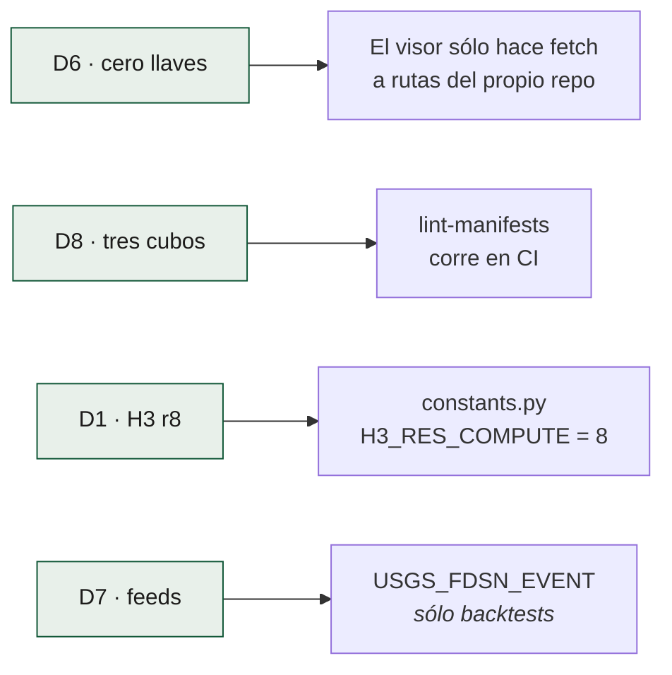
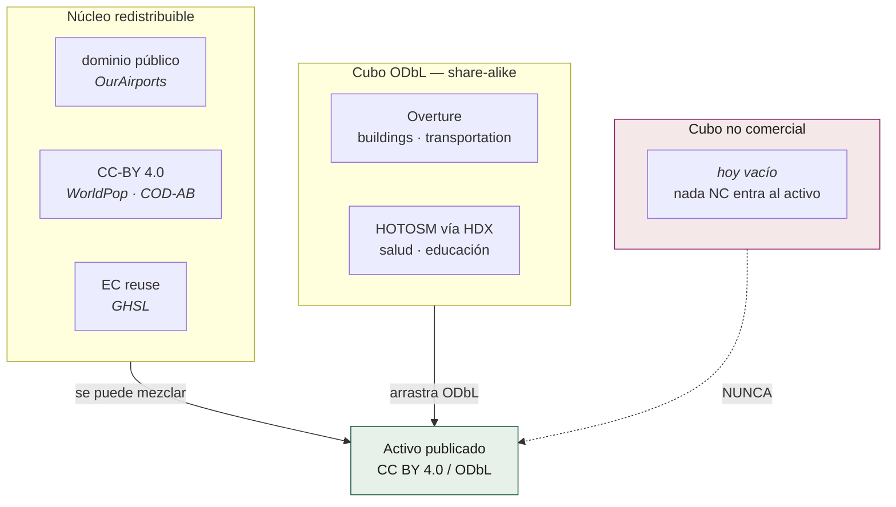

# Decisiones de diseño

Estas ocho decisiones vienen de [`ESPECIFICACION.md`](../../ESPECIFICACION.md) §2.
No son parámetros ajustables: cambiar una cambia el comportamiento publicado
del sistema y obliga a actualizar los golden tests.

| # | Decisión | Elegido | Descartado, y por qué |
|---|---|---|---|
| **D1** | Unidad de análisis | H3 r8 para cómputo, r7/r6 agregados para el visor, más crosswalk a división político-administrativa | Sólo municipios (pierde el detalle intraurbano); grid propio (no interoperable) |
| **D2** | Formato | GeoParquet particionado + PMTiles | PostGIS: exige un servidor vivo, o sea costo y mantenimiento |
| **D3** | Cómputo | DuckDB con extensiones `spatial` y `h3`, dentro del runner | Spark/Sedona (sobredimensionado); Google Earth Engine (dependencia de cuenta y de sus términos) |
| **D4** | Orquestación | GitHub Actions + `workflow_dispatch` + keepalive | Servidor propio. **La espec ya documentaba el camino al cron externo**, que es el que hoy da los 5 minutos |
| **D5** | Publicación | GitHub Releases + Pages | Servidor de mapas dinámico |
| **D6** | Visor | Estático: MapLibre GL JS, **cero llaves de API** | Visor con backend: una comunidad no puede sostener un SLA |
| **D7** | Disparo | Feeds GeoJSON en tiempo real de USGS | Polling a FDSN, que el propio USGS desaconseja para apps automatizadas |
| **D8** | Licencias | Núcleo redistribuible separado *físicamente* de derivados no comerciales | Mezclar: contaminaría el dataset y bloquearía el reuso |

## Cómo se hacen cumplir

Los valores viven en `pipelines/common/constants.py`, con esta advertencia en
su docstring: *"Todo valor aquí es una decisión de diseño citada, no un
parámetro ajustable al vuelo"*.

## La regla de los tres cubos (D8)

`pipelines/common/licensing.py` implementa `bucket_for(licencia)` y el lint de
manifests falla en CI si una capa entra en el cubo equivocado. El caso concreto
que esto bloquea: **Major TOM** (ESA Phi-lab, CC-BY-SA) no puede entrar al
activo porque arrastraría el share-alike al cubo entero; **AlphaEarth**
(Google DeepMind, CC-BY) sí podría. La decisión ya está tomada y es de
licencia, no de calidad.

## Decisiones del visor, tomadas el 1-sep-2026

Salieron de recorrer la pagina publicada como usuario final. Las tres se
tomaron con medida, no con gusto.

### Velar lo que no es America Latina, en vez de reencuadrar

La caja de la region es alta —73° por 76°— y el panel del mapa es apaisado en
todo escritorio: `fitBounds` encaja por la altura y el ancho sobra. Medido en la
pagina publicada: 191° de longitud visibles en 1540 px, con la region ocupando
el 38 % del ancho y Africa occidental **rotulada**.

Llenar el ancho obliga a recortar latitud, y el primer recorte se lleva Ciudad
de Mexico, Monterrey y Santiago. **Se ensena la region entera y se apaga lo
demas.** Detalle en [`../visor/capas-y-modos.md`](../visor/capas-y-modos.md).

### El fuego se dibuja con simbolos proporcionales, no con calor ni con bins

La vista continental era una mancha porque **la tinta no cabia**: 12.767
simbolos ponian 1,23 veces el lienzo. Se probaron cuatro alternativas sobre la
pagina real y se descarto el mapa de calor **por medida**: con
`heatmap-intensity` y `heatmap-radius` fijos, el mismo punto sale carmesi a zoom
2, naranja a zoom 4 y del color del papel a zoom 6. `heatmap-density` cuenta
vecinos por pixel de pantalla, no energia — no se puede rotular en MW.

El clustering agrupa por proximidad **en pantalla**, y a escala continental el
radio se traga paises: los conteos acaban flotando sobre el Pacifico.

### Tres mapas base, no cinco

OpenFreeMap publica cinco estilos. `liberty` y `fiord` son de colores saturados
y sobre ellos las rampas de intensidad y de fuego dejan de leerse. Ofrecer un
mapa base que estropea el dato no es dar una opcion, es dar una trampa. Los tres
que quedan llevan escrito lo que cuestan.

---

## Decisiones abiertas

Estas no están cerradas y viven en [`PENDIENTES.md`](../../PENDIENTES.md):

- **MapLibre y h3-js vienen de unpkg sin `integrity`.** Vendorizarlos son ~800 KB
  en el repo a cambio de eliminar una dependencia de terceros en tiempo de
  ejecución. Contradice parcialmente el espíritu de D6.
- **Coropletas r7/r6 en PMTiles**: declaradas en D1/D2, todavía no construidas.
  El resto del visor funciona sin ellas.
- **`cont_mmi.json` en vez de `grid.xml`: medido, y el argumento no se
  sostiene.** Era la crítica metodológica más seria que este sistema podía
  recibir, y la justificación era de rendimiento, no científica. El 1-sep-2026 se
  midió sobre **cuatro eventos**, con el criterio fijado de antemano —3 %—:
  cinco de las ocho medidas se salen, y los cuatro se salen en al menos un
  umbral. En MMI≥7: Chocó **+11,8 %**, Venezuela **+34,0 %** y **+31,1 %**,
  Muisne +1,5 % —pero +11,0 % en MMI≥6—.

  El mecanismo importa más que la cifra: `cont_mmi.json` describe el borde de
  MMI 7 con **103 vértices y paso mediano de 4,2 km**, sobre una rejilla de
  **1 km**. Es un producto de dibujo consumido como producto de análisis. No se
  pierde área —cero celdas sin contorno— pero el valor asignado difiere, y donde
  el borde cruza una ciudad densa decide si la ciudad cuenta: el 68 % del delta
  del Chocó es Manizales.

  El signo es siempre el mismo —la rejilla da más, como predice el suelo de
  banda— y en los cuatro eventos no se pierde área. Lo que no se predice es la
  **magnitud**: va del 1,5 % al 34 % y no sigue al grosor del contorno. Por eso
  no cabe publicar una corrección ni una banda de error; no hay factor estable
  que aplicar.

  Y el coste que se quiso evitar no existe: la medición completa tarda **6
  segundos**. Cambiar el método queda anotado en `PENDIENTES.md` §2.1.nonies —no
  es un fallo que se arregle en caliente, porque mueve todas las cifras
  publicadas—. Reproducible con `scripts/delta_contornos_vs_grid.py`.
- **El redondeo de prosa y el de tabla no coinciden.** RF-06 fija dos cifras
  significativas en prosa, así que el `.md` publica «110 mil» donde el visor
  publica «108.000». Las dos son ciertas y quien las compare sin saber la regla
  concluye que una está mal. Por ahora el `.md` **dice** que va redondeado y
  dónde están las cifras exactas; unificarlas rompería la regla de la
  especificación y es una decisión editorial sin tomar.
