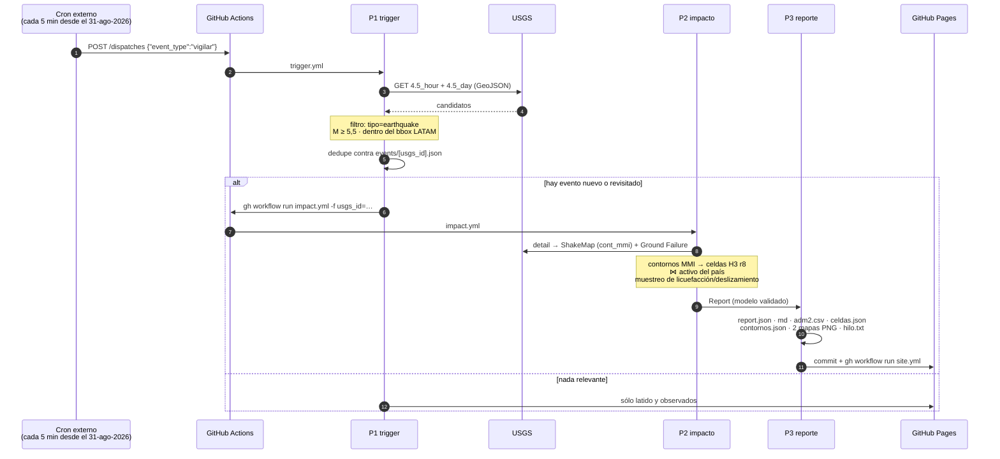
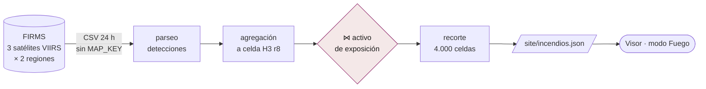
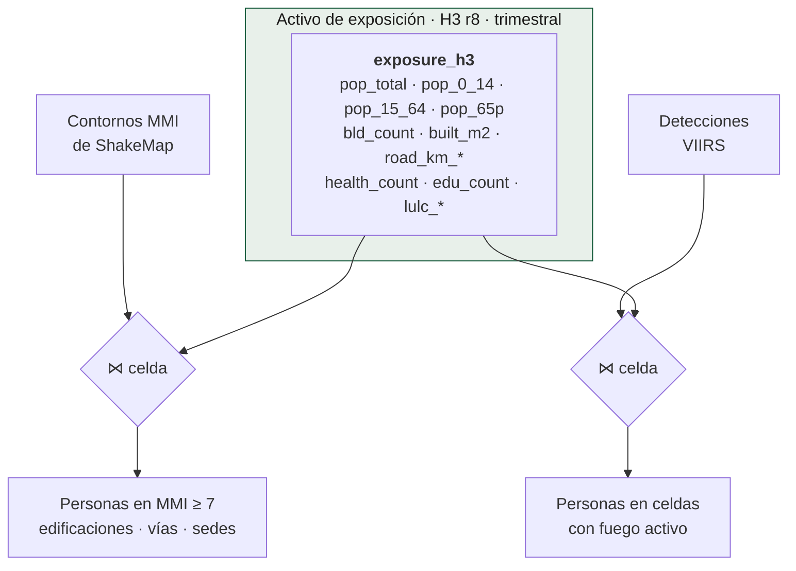

# El viaje del dato

Dos caminos distintos comparten el mismo denominador. Este documento sigue
ambos hasta el píxel.

## Camino A — un sismo, de la fuente al reporte

**La decisión que evita el falso disparo** está en tres condiciones explícitas
y testeables sin red (`pipelines/p1_trigger/filters.py`): es un terremoto (no
explosión ni evento de hielo), es M ≥ 5,5, y cae dentro de la ventana LATAM.
El umbral de magnitud es la defensa principal contra la "cifra alarmista" del
registro de riesgos.

**Por qué dos feeds.** `4.5_hour` es el feed del camino crítico. `4.5_day` es
el respaldo: GitHub documenta demoras de 5 a 30 minutos en los crons
programados, y si el runner despierta tarde el feed horario ya no alcanza.
Los duplicados entre ambos se descartan por `usgs_id`.

## Camino B — el fuego, cada seis horas

Lo que se cuenta son **detecciones, no incendios**: los tres satélites
sobrevuelan el mismo fuego y producen tres filas. Medido el 26-ago-2026, antes
del pico de temporada: 66.806 detecciones en 24 h → 22.701 celdas, o sea 2,9
detecciones por celda. Llamarlas "focos" invitaría a leer el número como
cantidad de fuegos, que es el triple de los que hay.

**El recorte a 4.000 celdas** no es por potencia: entran primero todas las que
tienen gente debajo, ordenadas por población, y el resto se rellena por
potencia radiativa. El visor lo dice con esas palabras porque durante un tiempo
dijo otra cosa —"las 4.000 celdas de mayor energía"— y era falso.

## El denominador común

Este es el motivo de que el visor tenga un selector de amenaza y no dos mapas:
cambia la amenaza, no el denominador. Cualquier amenaza futura que sepa
resolverse a celda H3 —inundación, ceniza volcánica— entra por el mismo join.

## Qué se dispara con qué reloj

| Pipeline | Cadencia | Quién lo dispara |
|---|---|---|
| **P1 trigger** | cron GH `*/30` | el cron externo → `repository_dispatch` está declarado y sin conectar; lo que corre hoy es el interno |
| **P2 + P3** | por evento | el propio P1, cuando el filtro deja pasar algo |
| **P5 incendios** | cada 6 h | cron propio, y P1 lo despierta si lleva más de 6 h |
| **Frescura** | cada 3 h | cron propio, y P1 lo despierta si lleva más de 3 h |
| **Deriva de contrato** | diaria, 08:00 UTC | cron |
| **Simulacro** | mensual, día 5 | cron |
| **Keepalive** | días 1 y 15 | cron |
| **P0 exposición** | trimestral | cron (1 de ene, abr, jul, oct) |

El detalle de cada reloj y de quién lo dispara está en
[`../acciones/`](../acciones/).
