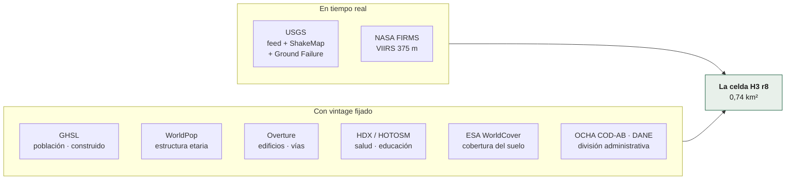

# Datos

| Documento | Qué explica |
|---|---|
| [`fuentes.md`](fuentes.md) | De dónde sale cada dato, bajo qué licencia y qué limitación declara |
| [`agregaciones.md`](agregaciones.md) | Cómo se convierte cada fuente en una columna de la celda |
| [`activo-h3.md`](activo-h3.md) | El esquema de `exposure_h3`, columna por columna |

## El principio

**Todo dato que entra al sistema es público y no pide credenciales.** No es una
preferencia estética: es lo que permite que cualquiera reproduzca el activo y
que una comunidad lo mantenga sin presupuesto.

**La diferencia entre las dos columnas importa.** Lo de la izquierda se
consulta cada vez y cambia; lo de la derecha se congela en un manifest con su
hash sha256, y sólo cambia cuando alguien reconstruye el activo. Por eso un
reporte es reproducible: dice exactamente qué vintage consumió.

## La unidad

Todo se resuelve a **celda H3 r8**: hexágonos de **~0,74 km²** (D1). El visor
consume agregados r7/r6 donde los hay, y ahí cada hexágono son **~5,2 km²**.

> **Esas dos cifras se confundieron durante meses, y costó caro.** Este mismo
> documento decía que una celda r8 medía 5,2 km², que es el área de r7. El visor
> se lo creyó: la capa de incendios publica celdas r8 sin agregar —P5 no pasa por
> el `cell_to_parent` que sí hace el lado sísmico— y multiplicaba por 5,2. **Cada
> área de foco salía siete veces mayor de lo real**, y el rótulo prometía
> hexágonos de 5,2 km² sobre hexágonos de 0,74. Encontrado el 31-ago-2026
> revisando los textos del visor, no por una prueba.

Por qué hexágonos y no una grilla: los hexágonos tienen todos los vecinos a la
misma distancia, no tienen la distorsión de área de una grilla en latitud, y
H3 es un estándar con implementaciones en todas partes — incluido el navegador,
que es cómo el visor dibuja las celdas sin servidor.

## Lo que el sistema NO agrega

- **No estima área quemada.** El propio FIRMS lo desaconseja.
- **No estima víctimas ni daño.** Publica exposición.
- **No inventa el dato ausente.** Una capa que no midió da "sin medir", no cero.
- **No mezcla licencias.** Ver la regla de los tres cubos.
