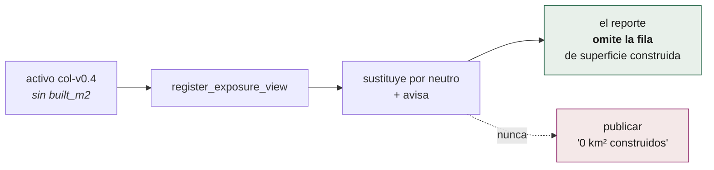

# El activo: `exposure_h3`

Una fila por celda H3 r8. Es el denominador de todo el sistema: lo que P2 cruza
con la intensidad sísmica y lo que P5 cruza con los focos de calor.

| | |
|---|---|
| **Clave primaria** | `h3_08` |
| **Particionado** | Hive: `iso3=COL/layer=exposure/…` |
| **Formato** | GeoParquet |
| **CRS de publicación** | EPSG:4326 |
| **Reconstrucción** | Trimestral |
| **Dónde vive** | GitHub Release, no en git |

Contrato completo: [`schemas/parquet/tables.yaml`](../../schemas/parquet/tables.yaml).

## Las columnas

### Identidad y territorio

| Columna | Tipo | Fuente | Nota |
|---|---|---|---|
| `h3_08` | UINT64 | — | La celda |
| `iso3` | VARCHAR | crosswalk | |
| `adm1_id` | VARCHAR | crosswalk | Departamento / estado |
| `adm2_id` | VARCHAR | crosswalk | Municipio. **VARCHAR siempre**: el DIVIPOLA de 5 dígitos pierde el cero inicial como entero |

### Población

| Columna | Tipo | Fuente |
|---|---|---|
| `pop_total` | DOUBLE | GHS-POP 2025 |
| `pop_0_14` | DOUBLE | WorldPop age-sex |
| `pop_15_64` | DOUBLE | **residuo** de los otros dos |
| `pop_65p` | DOUBLE | WorldPop age-sex |
| `pop_alt_worldpop` | DOUBLE | WorldPop total, **solo alimenta la banda de discrepancia** |

### Construcción

| Columna | Tipo | Fuente |
|---|---|---|
| `bld_count` | INTEGER | Overture buildings |
| `bld_area_m2` | DOUBLE | Overture buildings |
| `built_m2` | DOUBLE | GHS-BUILT-S 2025 |

> `built_m2` **contrasta** a `bld_count`: donde ninguna de las fuentes de
> Overture mapeó el barrio (conflaciona OSM, Microsoft, Google y Esri), el
> satélite sí lo ve. El reporte avisa cuando la razón entre ambas pasa de 1,5.

### Servicios y vías

| Columna | Tipo | Fuente |
|---|---|---|
| `health_count` | INTEGER | HOTOSM (HDX) |
| `edu_count` | INTEGER | HOTOSM (HDX) |
| `road_km_primary` | DOUBLE | Overture transportation |
| `road_km_secondary` | DOUBLE | Overture transportation |
| `road_km_other` | DOUBLE | Overture transportation |

Primarias y secundarias se publican aparte del total **porque no es lo mismo
que quede cortada una troncal que una calle de barrio**, y porque es la cifra
comparable con las estadísticas viales oficiales.

### Cobertura del suelo

`lulc_arbolado_pct`, `lulc_arbustos_pct`, `lulc_pastizal_pct`,
`lulc_cultivo_pct`, `lulc_construido_pct`, `lulc_humedal_pct` (DOUBLE) más
`lulc_px` (BIGINT).

Porcentajes sobre los píxeles **clasificados**; suman ≤ 100 salvo redondeo.
`lulc_px` dice cuánta evidencia hay detrás.

### Procedencia

| Columna | Tipo | Nota |
|---|---|---|
| `flags_calidad` | VARCHAR | Banderas separadas por coma. **Se publican, no se ocultan** |
| `src_manifest` | VARCHAR | Qué vintage produjo esta fila |

`src_manifest` es lo que hace auditable un reporte: cada celda dice de qué
build salió.

## Las banderas de calidad (§6.4)

Se calculan **una sola vez**, al construir el activo, en
`p0_exposure.build.SQL_FLAGS`, y viajan en `flags_calidad`.

> Aquí había una segunda copia, idéntica y sin llamador: dos definiciones de la
> misma regla que solo pueden divergir. La que manda es la de P0.

## Cómo lo consulta P2

```sql
-- Simplificado. Las consultas reales viven en exposure_join.py como
-- constantes con marcadores nombrados, no armadas por concatenación:
-- son parte del contrato revisable del sistema.
SELECT e.*, i.mmi
FROM read_parquet('exposure/iso3=COL/**/*.parquet') e
JOIN impact_cells i USING (h3_08)
```

DuckDB con las extensiones `spatial` y `h3` lee el GeoParquet particionado
directamente, dentro del runner. El particionado por `iso3` significa que un
sismo en Colombia **no lee ni un byte** del activo de Chile.

## Compatibilidad hacia atrás

Un activo publicado hace meses puede no traer las columnas que el código de hoy
espera. `register_exposure_view` sustituye las ausentes por un valor neutro y
**devuelve la lista de sustituidas**: el reporte omite esa fila en vez de
publicar un cero.



El caso real: `built_m2` llegó en `col-v0.5` cuando el Release publicado era
`col-v0.4`. Sin esto, **el primer sismo después de actualizar el código y antes
de republicar el activo se habría quedado sin reporte**.

## Estado por país

19 países con manifest, **19 construidos**, 649.793.406 personas en la malla,
peor desvío +4,94 %. El detalle vivo está en
[`site/cobertura.json`](../../site/cobertura.json), que sale de los manifests
y por eso no puede prometer de más.

Colombia, como referencia: Release `exposure-col-20260824`, manifest `col-v0.5`,
**559.103 celdas**, 52.620.466 habitantes, 15,3 M edificaciones, 9.888 sedes de
salud, 45.710 educativas, 307.314 km de vía, 1.122 municipios. Desvío contra el
DANE: **−0,72 %**.

Overture **conflaciona** OSM, Microsoft Building Footprints, Google Open
Buildings y Esri: ya no es cierto que donde OSM no mapeó no haya edificios. Eso
cambia el sentido del contraste `built_m2` / `bld_count`: la desproporción ya no
señala «zona sin mapear en OSM» sino zonas donde ninguna de las cuatro fuentes
tiene huellas, que son muchas menos y de otro tipo (rural disperso, informal
reciente).
