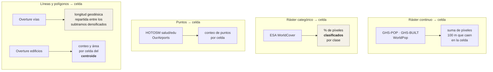
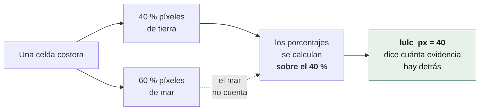
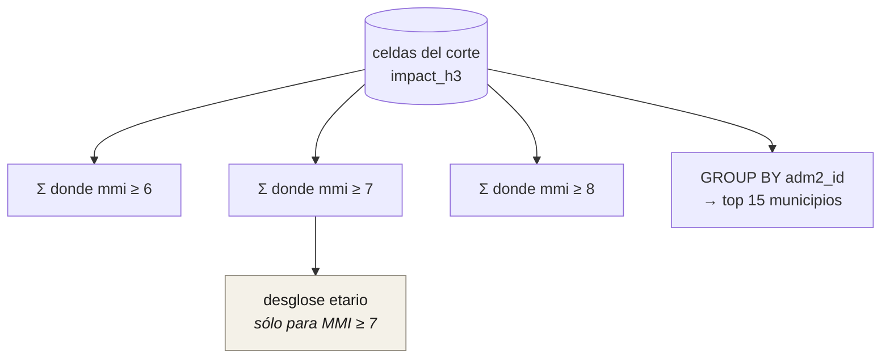

# Agregaciones

Cómo se convierte cada fuente en una columna de la celda. Es la parte del
sistema donde un error no se ve: una agregación mal hecha produce una cifra
perfectamente plausible.

## Las cuatro familias



## Las decisiones que no son obvias

### Vías: recortadas, no asignadas al centroide

Una carretera de 40 km cruza muchas celdas. Asignarla entera a la celda de su
centroide daría 40 km en una celda y 0 en las vecinas.

Lo que se hace —y este documento lo describía mal— es **densificar y repartir**:
la longitud se mide entera con `ST_Length_Spheroid`, que es geodésica sobre el
elipsoide (no hay ninguna reproyección equiárea en el repositorio, y una
equiárea sería además la clase equivocada para medir longitud), la vía se parte
en *n* subtramos de ~200 m, y cada subtramo aporta `km/n` a la celda de **su
punto medio**.

El punto medio, no el extremo: `ST_LineInterpolatePoints(geom, 1/n, true)`
devuelve las fracciones 1/n … 1,0, o sea el final de cada subtramo y nunca el
principio, con un sesgo sistemático de medio subtramo siempre en la dirección
del trazado. Se piden 2n puntos en medios pasos y se conservan los impares.
`test_vector_h3.py` lo comprueba, y comprueba también que `sum(km/n)` sigue
siendo `km`.

> Esta cifra estuvo mal en el README por un factor de seis, porque se copió a
> mano y el activo se reconstruyó después. Hoy `test_cifras_del_readme.py`
> falla si la tabla del README se separa de `report.json`.

### Edificaciones: por centroide, y se asume

Un edificio pertenece a la celda de su centroide, aunque cruce el borde. A
0,74 km² por celda, el error es despreciable frente al de la propia cobertura
de OSM.

### Cobertura del suelo: el porcentaje es sobre lo clasificado



En la costa media celda es mar, y el mar no es una clase de cobertura. Los
porcentajes van sobre los píxeles **clasificados**, y `lulc_px` publica cuántos
eran: *"una celda con nueve píxeles y otra con ciento cuarenta no merecen la
misma confianza"*.

### Estructura etaria: la banda central es el residuo

```
pop_0_14   ← conteo de WorldPop
pop_65p    ← conteo de WorldPop
pop_15_64  ← pop_total − pop_0_14 − pop_65p
```

`pop_total` viene de GHS-POP y los extremos de WorldPop: son dos modelos
distintos. La banda central, al ser el residuo, **absorbe toda la diferencia
entre ambos**. Es una decisión declarada, no un descuido, y la banda de
discrepancia publicada la acota.

### Población: suma dasimétrica

No se reparte población por área: se suman los píxeles de 100 m de GHS-POP,
que ya está desagregado dasimétricamente usando volumen construido. La celda
hereda la desagregación de la fuente en vez de inventar la suya.

## De la celda al reporte



**Las bandas son acumulativas**: "personas en MMI ≥ 7" incluye a las de MMI 8.
El desglose por edad se publica **solo para MMI ≥ 7**
(`MMI_BAND_AGE_BREAKDOWN = 7`): más abajo la incertidumbre del modelo etario
sería mayor que la señal.

### Ground Failure

Se muestrea el ráster por celda. Un valor ≥ **0,10** cuenta como "alto" para el
conteo de población expuesta. `NaN` significa fuera de la huella del modelo — no
cero, no "sin riesgo".

El ráster de licuefacción **no es probabilidad**: el producto de USGS deriva
por calibración una **cobertura areal** —la fracción de la celda que se espera
cubierta por manifestaciones de licuefacción—, y el de deslizamiento sí es
probabilidad. Llamarlas igual afirma de una lo que solo vale para la otra, y el
`report.md` ya las distingue (`GF_UNIDAD`). El umbral 0,10 se aplica a las dos,
pero significa cosas distintas en cada una.

## La banda de discrepancia

El sistema publica dos poblaciones de la misma celda: `pop_total` (GHS-POP) y
`pop_alt_worldpop` (WorldPop). La segunda **nunca es la cifra principal**: su
único trabajo es acotar cuánto podrían diferir dos modelos razonables sobre el
mismo territorio, y esa banda se publica en `incertidumbre`.

Es el reconocimiento explícito de que la cifra tiene un intervalo, en un
producto cuyo riesgo principal es que alguien lea un número redondo como si
fuera un censo.

## Once de veintiún eventos no llegan a MMI ≥ 7

Correr el catálogo regional entero enseñó algo que ninguna prueba sintética
habría encontrado: **once de los veintiún eventos no alcanzan MMI ≥ 7 sobre
población** —eran ocho de diecinueve cuando se midió por primera vez, y la
proporción se ha mantenido al crecer el catálogo—. Son los profundos y los de mar adentro, que en esta región son la
mitad. Tehuantepec 2017 —M8,2, 98 muertos— tiene su máximo sobre población
mexicana en **MMI 6,5**.

Hasta que se corrieron, el producto daba por supuesto que MMI ≥ 7 era *la*
banda y publicaba para esos once un titular de "0 personas" con una tabla de
municipios ordenada alfabéticamente. Ahora **se titula con la banda que el
evento alcanzó de verdad**.
