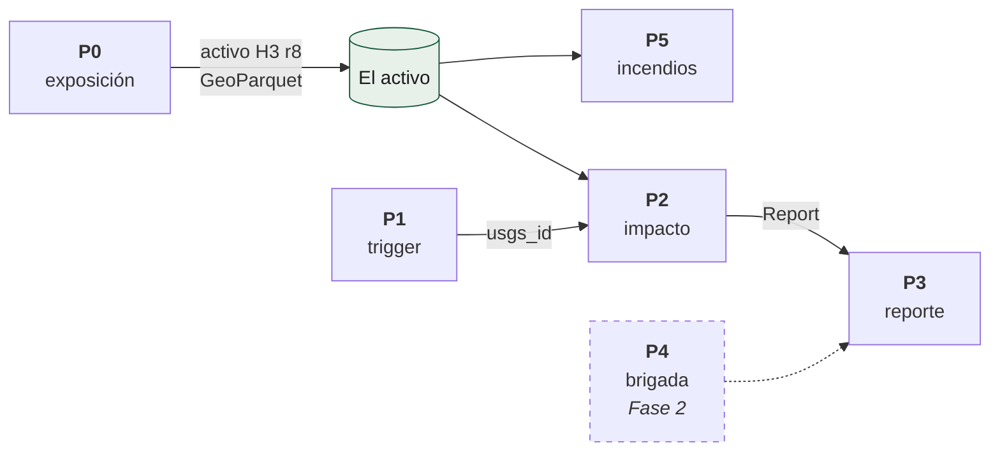

# Pipelines

Seis pipelines de Python 3.12, ~12.500 líneas. Todos se invocan por el mismo
CLI (`uv run centinela <comando>`) y ninguno necesita credenciales.

| Pipeline | Documento | Qué hace | Cadencia |
|---|---|---|---|
| **P0** | [`p0-exposicion.md`](p0-exposicion.md) | Construye el activo de exposición por país | trimestral |
| **P1** | [`p1-trigger.md`](p1-trigger.md) | Vigila el feed de USGS y decide qué merece reporte | cron `*/30` |
| **P2** | [`p2-impacto.md`](p2-impacto.md) | Cruza intensidad sísmica con exposición | por evento |
| **P3** | [`p3-reporte.md`](p3-reporte.md) | Emite los artefactos publicables | por evento |
| **P4** | [`p4-brigada.md`](p4-brigada.md) | Daño por edificación con IA | Fase 2 |
| **P5** | [`p5-incendios.md`](p5-incendios.md) | Cruza focos activos con exposición | cada 6 h |
| — | [`common.md`](common.md) | Los catorce módulos compartidos | — |

## Cómo se relacionan



**P2 y P5 son hermanos.** Ambos cruzan una amenaza contra el mismo activo; lo
único que cambia es de dónde sale la geometría de la amenaza (contornos MMI en
uno, detecciones VIIRS en el otro).

## El CLI

```bash
uv run centinela trigger              # P1 contra el feed vivo
uv run centinela impact <usgs_id>     # P2 + P3 de un evento
uv run centinela country --iso3 COL   # P0 de un país
uv run centinela incendios            # P5
uv run centinela status               # recalcula site/status.json
uv run centinela cobertura            # recalcula site/cobertura.json
uv run centinela frescura             # ¿la página va al día?
uv run centinela lint-manifests       # valida licencias y vintages
uv run centinela observados           # publica los vistos-y-no-despachados
uv run centinela reindexar            # reconstruye reports/index.json
uv run centinela regenerar-mapas      # re-renderiza los PNG
uv run centinela regenerar-textos     # rehace report.md y hilo.txt
uv run centinela contornos <usgs_id>  # extrae contornos MMI
uv run centinela paises-candidatos    # ¿de qué país es este sismo?
uv run centinela calibrar             # calibra contra referencia oficial
uv run centinela contraste            # Fase 2
uv run centinela fijar-insumos        # congela vintages en el manifest
```

Los atajos habituales están en el `Makefile`: `make setup`, `make check`,
`make trigger`, `make country ISO=COL`.

## Las dos guardias que protegen a todos

**El cero silencioso.** Una capa que no se construye entra vacía al ensamblaje,
el `LEFT JOIN` la vuelve ceros y el activo se publicaría sin que nada proteste.
`validate_layer_coverage` detiene el build si cualquier capa requerida suma
cero en todo el país.

**La función sin llamador.** `tests/unit/test_funciones_conectadas.py` recorre
el grafo de llamadas y falla si una función pública se queda sin quien la
invoque. Ha cazado: el reporte preliminar, el epicentro del mapa estático, tres
capas del activo y los asserts de §6.4: todos probados, ninguno conectado.
