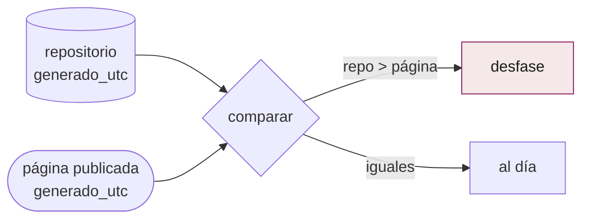
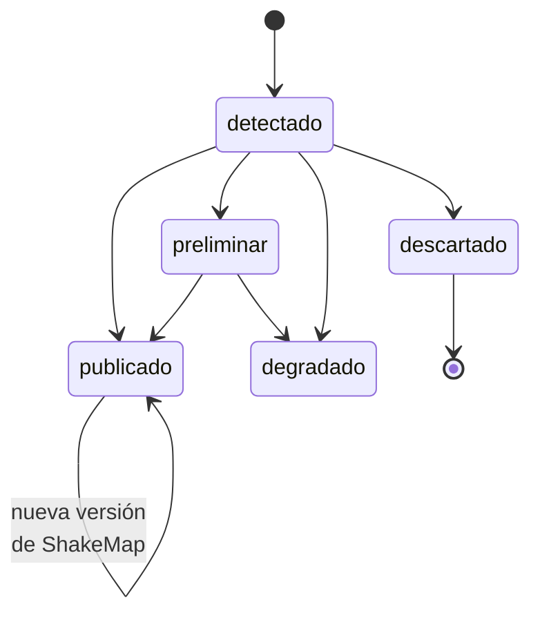

# `pipelines/common/` — los módulos compartidos

Catorce módulos que usan todos los pipelines. Ninguno es utilitario genérico:
cada uno existe por un fallo concreto o una regla del proyecto.

| Módulo | Qué resuelve |
|---|---|
| `constants.py` | Las decisiones de diseño citadas: umbrales, feeds, bandas MMI, resoluciones H3 |
| `state.py` | `event_state`: la máquina de estados de un evento |
| `http.py` | El **único** cliente HTTP del sistema |
| `manifest.py` | Vintages por país: fuente, URL, licencia, hash, fecha |
| `licensing.py` | La regla de los tres cubos y su verificación |
| `frescura.py` | ¿La página publicada va al día con el repositorio? |
| `status.py` | La página de estado: latencia y cadencia medidas |
| `cobertura.py` | Qué países puede atender el sistema, y con qué |
| `geo.py` | Primitivas geométricas del camino crítico (bbox, haversine) |
| `toponimos.py` | El lugar de un sismo, en español |
| `hdx.py` | Resolución de recursos en Humanitarian Data Exchange |
| `formatting.py` | Formato de cifras del reporte |
| `logging.py` | Logging estructurado: una línea JSON por evento |
| `paths.py` | Rutas canónicas del repositorio |

## Los que llevan una historia

### `frescura.py` — las diecisiete horas



> El 26-ago-2026 el visor llevaba **diecisiete horas** sirviendo datos viejos y
> nada estaba en rojo. Un push hecho con `GITHUB_TOKEN` no dispara otros
> workflows, así que `site.yml` no corría: los dos workflows en verde, el
> artefacto correcto commiteado, y la página congelada en el latido de las
> 02:53. Salió a la luz porque una persona sintió un sismo, fue a mirar y
> preguntó.

Vigila **una sola cosa**: que el repositorio avance y la página no. Si el vigía
muriera, los dos se quedarían quietos a la vez y esto no diría nada — de eso se
ocupa el latido externo. Mezclar las dos alarmas daría una incapaz de decir cuál
de las dos cosas se rompió.

### `toponimos.py` — el lugar, en español (RF-06)

USGS publica `"26 km WSW of Tocopilla, Chile"`. El reporte dice
`"26 km al OSO de Tocopilla, Chile"`. Un reporte para gestión del riesgo en
América Latina que dice "WSW" no está terminado.

### `licensing.py` — los tres cubos

`bucket_for(licencia)` clasifica cada fuente en núcleo redistribuible, ODbL
(share-alike) o no comercial. El lint falla en CI si una capa entra en el cubo
equivocado. Ver [`../arquitectura/decisiones.md`](../arquitectura/decisiones.md).

### `status.py` — la latencia que se publica, no la que se promete

```json
"objetivo": {"p50_min": 60, "p95_min": 90},
"medido":   {"eventos_publicados": 0, "backtests_excluidos": 21,
             "p50_min": null, "p95_min": null, "peor_min": null},
"cadencia": {"declarado_min": 30, "p50_min": 165.9,
             "p90_min": 484.4, "peor_min": 765.9, "revisiones": 26}
```

Tres decisiones en esa estructura:

1. **`objetivo` y `medido` son campos distintos.** Publicar solo el objetivo
   sería publicar una promesa como si fuera un hecho.
2. **`medido.p50_min` es `null`, no 0.** Todavía no ha habido un evento en
   vivo. Un cero ahí se leería como "latencia cero", que es lo contrario de
   "sin medir".
3. **Los 21 backtests se cuentan aparte.** Reconstruir el Chocó con los
   productos que USGS publicó entonces no dice nada sobre cuánto tarda el
   sistema en vivo.

Y `cadencia` publica la distancia entre lo declarado (30 min) y lo real
(165,9 min de mediana, 765,9 en el peor caso) sin maquillarla. Es lo que
justifica el cron externo.

### `http.py` — un solo cliente

416 líneas para lo que parece resuelto. Existe porque todo acceso a red del
sistema pasa por aquí: reintentos, `User-Agent` identificable, descarga
atómica a disco, y —sobre todo— **una superficie única que los tests pueden
sustituir por fixtures**. Ninguna prueba de la suite toca la red.

### `state.py` — la base de datos



`descartado` es el único estado terminal. Un evento publicado se revisita
indefinidamente por si USGS saca un ShakeMap nuevo — el de Venezuela llegó a
v14.
