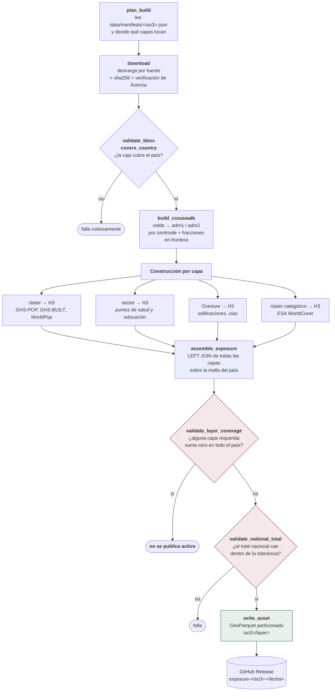

# P0 — Activo de exposición

**Qué hace:** construye, para cada país, la malla H3 r8 con todo lo que hay
expuesto. Es el denominador de todo el sistema.
**Cadencia:** trimestral (1 de enero, abril, julio, octubre) y a mano por país.
**Comando:** `uv run centinela country --iso3 COL` · `make country ISO=COL`
**Código:** `pipelines/p0_exposure/` (download, crosswalk, layers, build,
raster_h3, vector_h3, overture_h3, raster_categorico_h3, calibrar, sources/)

## El flujo

## Las diez capas

Declaradas en `pipelines/p0_exposure/layers.py`, que es la **única fuente de
verdad** para el lint de manifests, para el sitio y para la documentación.

| Capa | Fuente | Licencia | Columnas | Agregación |
|---|---|---|---|---|
| `pop_ghs` | GHS-POP R2023A ép. 2025 | EC reuse | `pop_total` | suma dasimétrica de píxeles 100 m |
| `pop_worldpop_agesex` | WorldPop age-sex R2025A | CC-BY 4.0 | `pop_0_14`, `pop_15_64`, `pop_65p` | suma por banda; 15-64 es el **residuo** |
| `pop_worldpop_total` | WorldPop constrained R2025 | CC-BY 4.0 | `pop_alt_worldpop` | suma de píxeles 100 m |
| `buildings` | Overture `buildings` | ODbL 1.0 | `bld_count`, `bld_area_m2` | conteo y área por celda del centroide |
| `built_ghsl` | GHS-BUILT-S R2023A ép. 2025 | EC reuse | `built_m2` | suma de superficie construida |
| `roads` | Overture `transportation` | ODbL 1.0 | `road_km_primary/secondary/other` | longitud **recortada por celda**, en proyección equiárea local |
| `health` | HOTOSM vía HDX | ODbL 1.0 | `health_count` | conteo de puntos |
| `education` | HOTOSM vía HDX | ODbL 1.0 | `edu_count` | conteo de puntos |
| `divisions` | MGN del DANE + COD-AB de OCHA + Overture | CC-BY 4.0 | `iso3`, `adm1_id`, `adm2_id` | centroide + tabla de fracciones en frontera |
| `airports` | OurAirports | dominio público | — | conteo de puntos · **no requerida** |

Más la cobertura del suelo (ESA WorldCover 2021), que aporta `lulc_*_pct` y
`lulc_px`.

**El orden importa**: población va primero, porque el desglose etario y la
banda de discrepancia dependen de `pop_total`.

## Las tres validaciones que pueden detener un build

### 1. `validate_bbox_covers_country`
Antes de descargar nada pesado, comprueba que la caja de trabajo cubre el país.
Una caja mal puesta produciría un activo correcto y truncado, que es la peor
combinación.

### 2. `validate_layer_coverage` — el cero silencioso

Una capa que no se construye entra vacía al ensamblaje, el `LEFT JOIN` la
vuelve ceros y el activo se escribiría sin que nada proteste: el assert de
total nacional sólo mira población.

> Es preferible no publicar activo que publicar uno que informa cero donde no
> midió nada.

### 3. `validate_national_total`
Contrasta el total de población de la malla contra la cifra oficial de
referencia del país. Cada país declara su `tolerancia_pct` en el manifest.
El peor desvío de los 19 países construidos es **+4,94 %** (Venezuela, y está
explicado); Colombia va en **−0,72 %** contra el DANE.

## Manifests: el vintage de cada país

`data/manifests/<iso3>.json` registra, por capa: fuente, URL, licencia, hash
sha256 y fecha. Es lo que hace **reproducible** un activo: dos builds del mismo
manifest dan el mismo resultado.

`centinela lint-manifests` corre en CI y falla si una capa entra en el cubo de
licencia equivocado (D8) o si un vintage no está fijado.
`verificar_licencia_declarada` va más allá: contrasta la licencia declarada en
el manifest contra la que la fuente publica **en cada build**, para cazar la
deriva.

## El estado actual

| | |
|---|---|
| Países con manifest | 19 |
| Países construidos | **19** |
| Población en la malla | **649.793.406** |
| Peor desvío | +4,94 % |

Se publica en `site/cobertura.json`, que sale de los manifests — así que la
página **no puede prometer más países de los que se construyeron de verdad**.

## Por qué el activo no va en git

Pesa. Se publica como GitHub Release (`exposure-col-20260824`, manifest
`col-v0.5`: 559.103 celdas para Colombia) y P2/P5 lo descargan en el runner.
El procedimiento completo está en [`../PUBLICAR_ACTIVO.md`](../PUBLICAR_ACTIVO.md).
