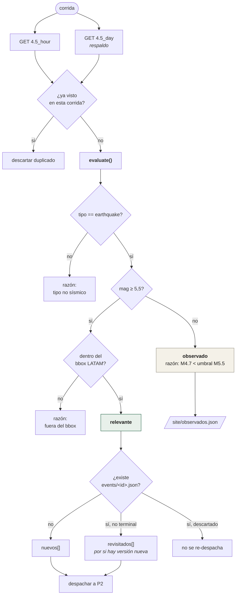

# P1 — Trigger

**Qué hace:** vigila el feed de USGS, decide qué merece un reporte, y deja
constancia de todo lo que vio.
**Cadencia:** cron de GitHub Actions `*/30`, más `repository_dispatch` para un cron
externo que todavía no está conectado. Lo declarado no es lo que corre: medido entre
el 25 y el 30 de agosto sobre 23 latidos, `p50 157 min · p90 462 · peor 766`.
**Comando:** `uv run centinela trigger [--dry-run]`
**Código:** `pipelines/p1_trigger/` (feed, filters, observados, run)

## El flujo



## El filtro, en tres condiciones

`pipelines/p1_trigger/filters.py` — todas explícitas y testeables sin red:

```python
if candidate.tipo != "earthquake":  # explosiones, hielo, ruido
    return RelevanceDecision(False, f"tipo no sismico: {candidate.tipo}")
if candidate.mag < MIN_MAGNITUDE:  # 5.5
    return RelevanceDecision(False, f"M{candidate.mag} < umbral M{MIN_MAGNITUDE}")
if not bbox.contains(candidate.lon, candidate.lat):
    return RelevanceDecision(False, "fuera del bbox LATAM")
return RelevanceDecision(True, "dentro de alcance")
```

La decisión **siempre lleva su razón**, y esa razón se publica. El umbral M5,5
es la defensa principal contra el riesgo de "falso disparo / cifra alarmista"
del registro de riesgos (§7).

## Por qué dos feeds

| Feed | Papel |
|---|---|
| `4.5_hour` | El camino crítico. Ligero, se consulta primero |
| `4.5_day` | El respaldo. Cubre la demora del cron |

GitHub documenta demoras de 5 a 30 minutos en los crons programados —y este
repositorio ha medido hasta **12,8 horas**. Si el runner despierta tarde, el
feed horario ya no alcanza; el diario garantiza que no se pierda nada. Los
duplicados se descartan por `usgs_id`.

> `USGS_FDSN_EVENT` existe en las constantes pero **está prohibido en el camino
> crítico**: solo para backtests e históricos. El propio USGS desaconseja el
> polling a FDSN para aplicaciones automatizadas (D7).

## Los observados: la prueba de que el vigía miró

Un sismo M4,7 en Chile no genera reporte. Pero si no se publicara en ningún
lado, nadie podría distinguir "el vigía miró y decidió que no" de "el vigía
estaba caído".

```json
{"usgs_id": "us7000tcwp", "mag": 4.7, "lon": -70.4392, "lat": -22.1794,
 "depth_km": 52.1, "lugar": "26 km al OSO de Tocopilla, Chile",
 "origen_utc": "2026-08-30T05:19:51Z", "razon": "M4.7 < umbral M5.5"}
```

Ventana móvil de 5 días. El visor los dibuja como estrellas huecas, con la
etiqueta *"Sismo visto, sin reporte — por debajo de M5,5. Se vio y no se midió
su impacto"*.

## El límite del feed, y quién lo tapa

El vigía solo ve lo que está **en el feed**, y `4.5_day` son **24 horas**.
Pasado un día el evento desaparece de ahí y nadie vuelve a preguntar por él.

Eso importa porque RF-04 promete re-emitir al aparecer una versión nueva de
ShakeMap, y las revisiones duran mucho más de un día. Medido contra USGS sobre
los veinte eventos publicados, días desde el sismo hasta la última revisión:

| | |
|---|---|
| Mediana | **63 días** |
| Chocó (M7,4) | 11,5 días, hasta v7 |
| Venezuela, Catia La Mar (M7,5) | 61,2 días, hasta **v15** |
| Noviembre 2024 | 75,1 días, hasta v9 |

**Ninguno terminó de revisarse dentro de las 24 h del feed.** De ese hueco se
ocupa [`repaso.yml`](../acciones/mantenimiento.md), que pregunta por los
eventos de los últimos 90 días **por su identificador**, sin depender del feed.

## Idempotencia (RF-02)

Correr P1 dos veces sobre el mismo feed no crea trabajo duplicado. El estado
vive en `events/<usgs_id>.json` y solo `descartado` es terminal: un evento ya
publicado se **revisita** en cada corrida por si USGS sacó un ShakeMap nuevo,
y es P2 quien decide si hay trabajo real.

## La salida

```json
{"msg": "latido del trigger", "revisados": 14, "relevantes": 0,
 "observados": 2, "nuevos": [], "revisitados": [],
 "latido_utc": "2026-08-30T14:41:28Z"}
```

`--dry-run` corre todo esto pero no escribe `event_state`: es lo que usa el
simulacro mensual.
