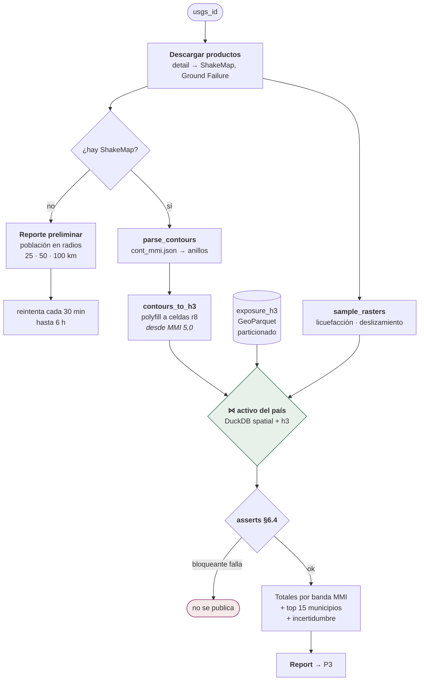

# P2 — Impacto

**Qué hace:** cruza la intensidad sísmica publicada por USGS con el activo de
exposición del país, y produce el modelo del reporte.
**Cadencia:** por evento.
**Comando:** `uv run centinela impact <usgs_id>`
**Código:** `pipelines/p2_impact/` (products, shakemap, exposure_join,
ground_failure, pipeline, run)

## El flujo

## De contornos a celdas

ShakeMap publica `cont_mmi.json`: polígonos de isointensidad. Son órdenes de
magnitud menos geometría que la malla, así que se convierten a H3 con polyfill
directamente.

**Se rellena desde MMI 5,0**, no desde 6. El reporte publica desde MMI 6, pero
rellenar un nivel más abajo cuesta poco y evita perder el borde. Rellenar
niveles aún más bajos multiplicaría las celdas sin cambiar una sola cifra
publicada.

## Ground Failure

| Fenómeno | Modelo principal | Respaldos |
|---|---|---|
| Deslizamiento | `jessee_2018_model.tif` | `nowicki_2014_global_model.tif`, `godt_2008_model.tif` |
| Licuefacción | `zhu_2017_general_model.tif` | `zhu_2015_model.tif` |

Se muestrea el ráster por celda. Una probabilidad ≥ **0,10** cuenta como "alta"
para el conteo de población expuesta.

`NaN` significa **fuera de la huella del modelo**, no "probabilidad
desconocida" ni cero. La distinción importa: un cero fabricado ahí sería una
afirmación de seguridad que nadie hizo.

## Los asserts de calidad (§6.4)

Van **contra las tablas del corte, no contra el activo entero**: preguntan por
las cifras que se están a punto de publicar, que es lo único que este reporte
afirma. El activo lo vigila P0 con sus propias reglas.

| Assert | Consulta | ¿Bloquea? |
|---|---|---|
| `pop_negativa` | `pop_total < 0` | **Sí** |
| `pop_nula` | `pop_total IS NULL OR adm2_id IS NULL` | **Sí** |
| `crosswalk_incompleto` | municipio en el corte que no está en `admin_lookup` | No |

El criterio de la distinción está escrito en el código:

> **Bloqueante** significa que las cifras serían falsas. Un reporte que no sale
> es un problema; uno que publica población negativa es una mentira, y además
> creíble.
> **No bloqueante** significa que la cifra es correcta y está incompleta. Se
> publica como nota de incertidumbre, porque tumbar un reporte durante un
> terremoto por un municipio sin nombre es peor que decir que falta.

`crosswalk_incompleto` no bloquea pero tampoco se calla: un municipio que llega
al corte y no está en el lookup **desaparecería del reporte sin una palabra** —
y podría ser el más expuesto del evento. Los totales nacionales siguen siendo
correctos porque salen de `impact_h3`; lo que falta es la fila.

## El contrato con activos viejos

Un activo publicado hace meses puede no tener las columnas que el código de hoy
espera. Si P2 las exigiera, **el primer sismo después de actualizar el código y
antes de republicar el activo se quedaría sin reporte** — y no hay peor momento
para eso.

`register_exposure_view` sustituye las columnas ausentes por un valor neutro y
**devuelve la lista de las que sustituyó**. El reporte omite la fila
correspondiente en vez de publicar un cero: una ausencia honesta, no una
medición falsa. El caso real fue `built_m2`, que llegó en `col-v0.5` cuando el
Release publicado era `col-v0.4`.

## El enrutado al país

Un epicentro no trae su ISO3. `centinela paises-candidatos` lo resuelve y
devuelve una lista ordenada —un sismo en el mar o cerca de una frontera puede
tocar dos países—. Si el activo del primero no existe, se reintenta con el
siguiente. Si ninguno existe, se abre una incidencia en vez de publicar ceros.

`ExposureCountryMismatchError` es la excepción que salta cuando el activo
cargado no corresponde al país del evento: un fallo ruidoso donde el silencio
habría producido un reporte con el denominador equivocado.
