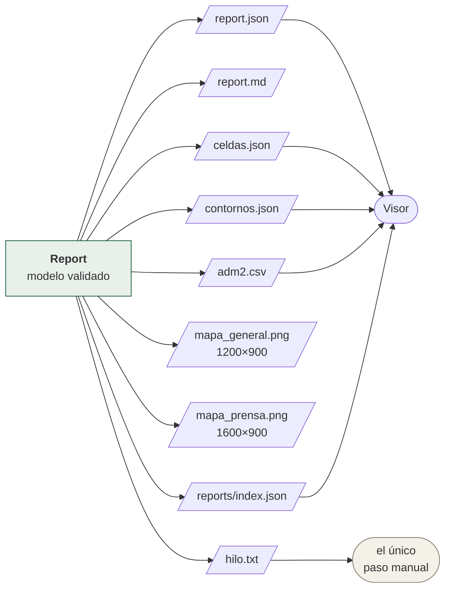
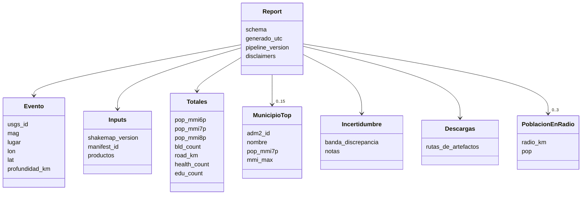

# P3 — Reporte

**Qué hace:** convierte el modelo `Report` en los ocho artefactos publicables.
**Cadencia:** por evento, justo después de P2.
**Código:** `pipelines/p3_report/` (model, markdown, csv_out, static_map,
contornos, celdas, changelog, run)

## Lo que emite



| Artefacto | Para quién |
|---|---|
| `report.json` | El visor y cualquier tercero. Validado contra [`schemas/report-1.0.schema.json`](../../schemas/report-1.0.schema.json) |
| `report.md` | Personas. Prosa en español con cifras redondeadas a 2 cifras significativas |
| `adm2.csv` | Analistas. Una fila por municipio, **cifras exactas** |
| `celdas.json` | El visor: la malla H3 del evento con sus columnas |
| `contornos.json` | El visor: las líneas de isointensidad |
| `mapa_general.png` | Uso general |
| `mapa_prensa.png` | Redes y prensa, con tipografía mayor |
| `hilo.txt` | El hilo listo para publicar — **el único paso manual permitido en todo el sistema** |

## El modelo



Todos son `@dataclass(frozen=True, slots=True)`: el reporte es inmutable una
vez construido.

## Prosa contra datos

`PROSE_SIGNIFICANT_DIGITS = 2`. En el markdown y el hilo, las cifras van
redondeadas: *"2,4 millones de personas"*. En CSV y parquet van **exactas**:
`2415793`.

No es inconsistencia. Una cifra con siete dígitos significativos en prosa
finge una precisión que el modelo no tiene; la misma cifra exacta en el CSV es
lo que necesita quien va a recalcular.

## El changelog de deltas (RF-04)

Un ShakeMap se revisa muchas veces —el de Venezuela llegó a **v14**—. Quien ya
leyó la versión anterior necesita saber qué cambió, no volver a leerlo entero
durante una emergencia.

```
pop MMI≥7: 340k → 355k
```

> Este módulo estaba escrito casi entero y **no lo llamaba nadie**.
> `Report.changelog` existía, `markdown.py` lo renderizaba si venía con algo,
> `format_delta_prose` daba exactamente ese formato — y ninguna línea del
> pipeline lo llenaba, así que la sección no apareció jamás en un reporte.
> El mismo patrón que el reporte preliminar y que tres capas del activo:
> piezas correctas, sin nadie que las una. Es el fallo que motivó
> `test_funciones_conectadas.py`.

## Los mapas estáticos

Dos variantes, distintas en tamaño y en cuerpo de letra:

| Variante | Píxeles | DPI |
|---|---|---|
| `general` | 1200 × 900 | 110 |
| `prensa` | 1600 × 900 | 130 |

Se renderizan con matplotlib, sin dependencias de servicios de mapas.
`centinela regenerar-mapas` los rehace sin recalcular el impacto.

## El índice

`rebuild_index()` recorre `reports/` y escribe `reports/index.json`: 21
entradas con `usgs_id`, `mag`, `lugar`, `iso3`, `lon`, `lat`, `pop_mmi7p`,
`pop_mmi6p`, `utc`, `shakemap_version`, `preliminar`, `backtest` y
`generado_utc`. Es lo primero que descarga el visor.

El campo `backtest` importa: separa los 21 reportes reconstruidos del catálogo
histórico de los que salgan en vivo. `site/status.json` los cuenta aparte
(`backtests_excluidos: 21`) para que no contaminen la latencia medida.

## Los disclaimers

Cuatro líneas fijas, obligatorias en **todo** artefacto (§1.2), definidas en
`constants.py`:

1. Exposición estimada, no daño observado.
2. Este sistema no es una alerta temprana ni una recomendación de evacuación.
3. No reemplaza a los servicios geológicos ni a las unidades de gestión del riesgo.
4. Fuentes, vintages y versiones consumidas: ver manifest enlazado.
