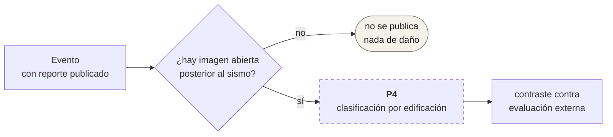

# P4 — Brigada de imagen

**Estado:** Fase 2. No implementado.
**Qué hará:** daño por edificación con IA, cuando exista imagen abierta
posterior al evento.

## Por qué está aquí si no existe

Porque el hueco es deliberado y conviene que se vea. El sistema publica
**exposición**, no daño; P4 sería la única pieza que se acercaría a estimar
daño, y sólo cuando haya imagen abierta que lo permita.

## Lo que sí existe hoy

`contraste.yml` y `pipelines/p2_impact/contraste.py` (183 líneas): el marco
para contrastar las cifras de exposición de CENTINELA contra una evaluación de
daño externa cuando alguien la publica. Se dispara a mano.

Es el primer paso de la Fase 2 y sirve para responder la pregunta que un
sistema de exposición no puede responder solo: **¿cuánto se parece la
exposición al daño real?**

## La frontera que no se cruza

El [`DISCLAIMER.md`](../../DISCLAIMER.md) es explícito y P4 no lo cambia: el
sistema no estima víctimas y no dictamina habitabilidad. Un modelo de daño por
imagen diría "este techo está colapsado", no "aquí murió alguien" ni "esta casa
es inhabitable" — esas dos siguen siendo competencia de quien tiene mandato
legal para decirlas.
