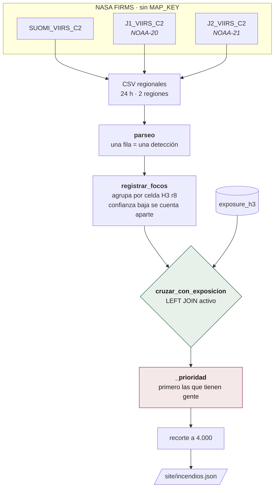
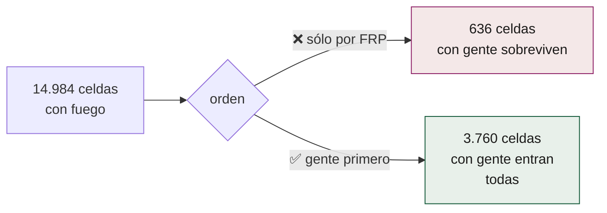

# P5 — Incendios

**Qué hace:** cruza los focos de calor de las últimas 24 h con el mismo activo
de exposición que usa P2.
**Cadencia:** cada 6 horas.
**Comando:** `uv run centinela incendios`
**Código:** `pipelines/p5_incendios/` (firms, focos_h3, incendios)

## El flujo



## Detecciones, no incendios

Los tres satélites llevan el mismo sensor VIIRS a 375 m. **No se reparten las
horas del día**: van en el mismo plano heliosíncrono, separados unos 50 minutos
en órbita, así que sus pasadas caen casi a la misma hora solar. Lo que aportan
los tres no es cobertura horaria sino más oportunidades de ver el mismo fuego
—y de que una nube no lo tape en las tres—. Y significa que el mismo fuego
produce varias filas.

Medido el 26-ago-2026, antes del pico de temporada:

```
66.806 detecciones en LATAM en 24 h  →  22.701 celdas H3 r8
2,9 detecciones por celda
```

> Llamarlas "focos" invitaría a leer el número como cantidad de fuegos, que es
> tres veces más de los que hay.

Y por eso el fichero publicado lleva una `nota` obligatoria:

> Detecciones de satélite (VIIRS, 375 m) en las últimas 24 horas, agregadas a
> celdas H3. Una detección no es un incendio. **NO se estima área quemada** —
> el propio FIRMS lo desaconseja, porque el muestreo espacial y temporal es
> irregular.

## Por qué los CSV y no la API

| | CSV regionales | API por bbox |
|---|---|---|
| ¿Pide `MAP_KEY`? | **No** | Sí |
| Límite | — | 5.000 peticiones / 10 min |
| Forma | un GET plano | consulta parametrizada |

Verificado el 26-ago-2026: HTTP 200 para las seis combinaciones de tres
satélites por dos regiones. Sin llave de API, que es la restricción D6.

## El recorte: primero la gente

Este es el corazón del pipeline, y estuvo al revés.



Medido el 27-ago-2026 sobre los diecinueve activos: de 14.984 celdas con fuego,
3.760 tenían población, y con el corte por potencia radiativa solo **636**
sobrevivían. Los 3.124 restantes eran celdas con gente y fuego moderado,
desplazadas por incendios enormes en Amazonia deshabitada.

> Este es un sistema de exposición. Un fuego sin nadie cerca es información; un
> fuego con tres mil personas debajo es la razón de que el sistema exista, y no
> puede caerse de la lista porque arda menos.

El relleno despoblado **también se ordena** (por FRP). Sin eso, el día que las
celdas con gente no llenen el cupo, el resto entraría en el orden en que DuckDB
las escupiera: arbitrario. Se encontró el 30-ago-2026 auditando el artefacto
E2E, un día en que había 5.244 celdas pobladas para 4.000 puestos y **el fallo
no se manifestaba** — que es exactamente cuando conviene arreglarlo.

## El `LEFT JOIN` es deliberado

Una celda con fuego y sin exposición sigue siendo información: un incendio en
selva sin nadie importa. Perderla por no tener población sería confundir *"no
hay nadie"* con *"no hay fuego"*.

Por el mismo criterio, la confianza baja **se cuenta aparte en vez de
descartarse** (`detecciones_baja`): publicar lo que se descarta es regla del
proyecto desde que un M4,9 sentido en media Colombia solo existía en un log de CI.

## Lo que publica

```json
"totales": {
  "celdas": 13145, "celdas_publicadas": 4000,
  "detecciones": 34283, "detecciones_baja": 1262,
  "celdas_con_poblacion": 3408, "pop_en_celdas_con_fuego": 568925,
  "salud_en_celdas_con_fuego": 171, "edu_en_celdas_con_fuego": 531,
  "bld_en_celdas_con_fuego": 252251, "frp_total_mw": 347392.6
}
"suelo": { "arbolado": 57.9, "pastizal": 23.1, "cultivo": 6.7,
           "humedal": 0.4, "celdas_medidas": 6643, "celdas_sin_medir": 6502 }
```

**`celdas_medidas` y `celdas_sin_medir` van siempre juntas al reparto de suelo.**
Un porcentaje sin denominador es una afirmación sin respaldo: decir "57,9 %
arbolado" callando que la mitad de las celdas no tienen cobertura conocida
sería exactamente el cero silencioso, en versión porcentaje.

## Sobre qué arde

La cobertura del suelo (`lulc_*` del activo, de ESA WorldCover) es lo que
convierte "hay fuego" en información: un foco sobre pastizal en agosto es
rutina agrícola; el mismo foco sobre arbolado es otra cosa. El reparto se
calcula **sobre la energía medida, no sobre el número de focos**, y el visor lo
dice con esas palabras.
