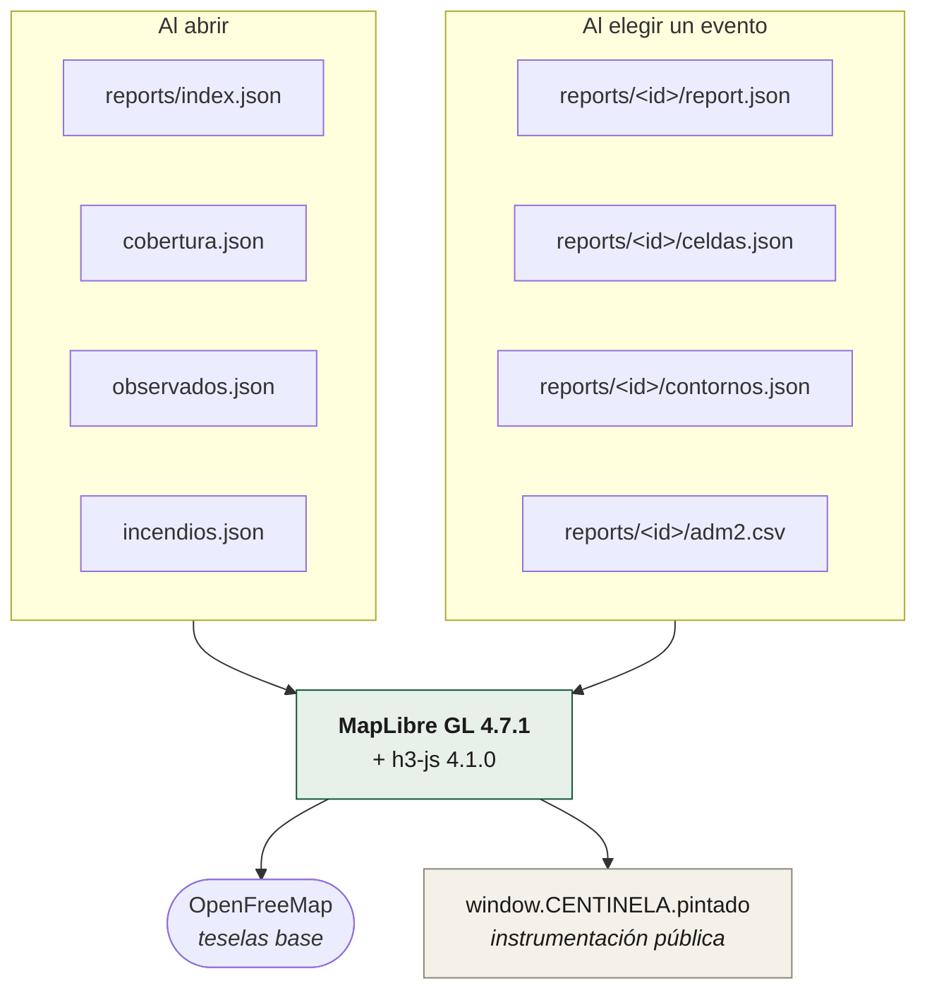
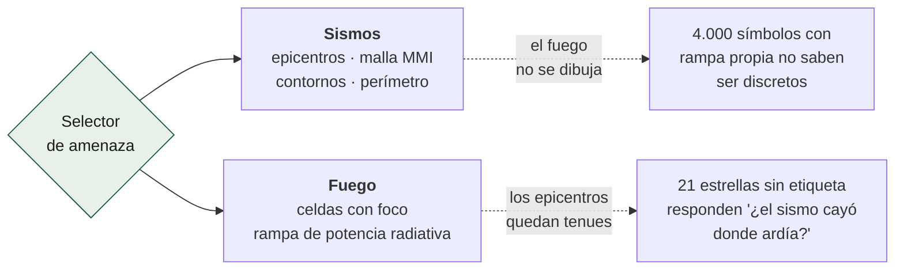

# El visor

Un HTML, un CSS y un JS. **Cero backend, cero llaves de API** (D6).

| Documento | Qué explica |
|---|---|
| [`consumo-de-datos.md`](consumo-de-datos.md) | Qué descarga, cuándo y por qué |
| [`capas-y-modos.md`](capas-y-modos.md) | Las doce capas, el selector de amenaza, el velo y los dos widgets |
| [`validacion.md`](validacion.md) | Cómo se prueba un visor en un navegador de verdad |

## La regla que lo ordena todo

> Todo lo que se ve sale de artefactos que **ya se publican para descargar** —
> `report.json`, `adm2.csv`, `celdas.json`— así que lo que hay en pantalla no
> puede divergir de lo que se lleva quien los baja. El visor no tiene una
> fuente propia, y esa es la idea.

No es una restricción técnica: es la garantía de que el visor no puede mentir
por su cuenta. Si una cifra en pantalla está mal, está mal también en el
fichero descargable, y eso es auditable.

## Arquitectura

## Las dependencias externas

| Qué | De dónde | Riesgo |
|---|---|---|
| MapLibre GL 4.7.1 | unpkg | **Sin `integrity`** — decisión abierta |
| h3-js 4.1.0 | unpkg | Idem |
| DM Sans, Familjen Grotesk, JetBrains Mono | Google Fonts | Degradación tipográfica si cae |
| Teselas base | OpenFreeMap | El mapa se queda sin fondo, los datos siguen |

El mapa base se puede cambiar entre tres estilos de OpenFreeMap —claro, oscuro
y con relieve— desde un widget del mapa. Los cinco que publica no se ofrecen
enteros: `liberty` y `fiord` son de colores saturados y sobre ellos las rampas
de intensidad y de fuego dejan de leerse. Ver
[`capas-y-modos.md`](capas-y-modos.md).

Vendorizar MapLibre y h3-js son ~800 KB en el repo a cambio de eliminar la
dependencia en tiempo de ejecución. Está en [`PENDIENTES.md`](../../PENDIENTES.md).

## Las dos amenazas

El visor tiene un **selector de amenaza** —Sismos / Fuego— y no dos mapas
separados, porque el activo de exposición es agnóstico a la amenaza: las mismas
celdas cuentan gente bajo MMI 7 y gente bajo fuego activo.

La regla de contexto es **asimétrica a propósito** y está explicada en
[`capas-y-modos.md`](capas-y-modos.md).

## Accesibilidad y responsive

- Tres tamaños probados: móvil (390×844), tableta y escritorio. El encuadre
  inicial se mide además en cinco: en ninguno queda fuera de vista un sitio con
  reporte publicado.
- El selector de amenaza es un `role="group"` con `aria-pressed`.
- Cada cambio de modo se anuncia por región viva.
- Ningún texto se pisa con otro en ningún tamaño — hay una prueba que lo
  comprueba midiendo cajas reales.
