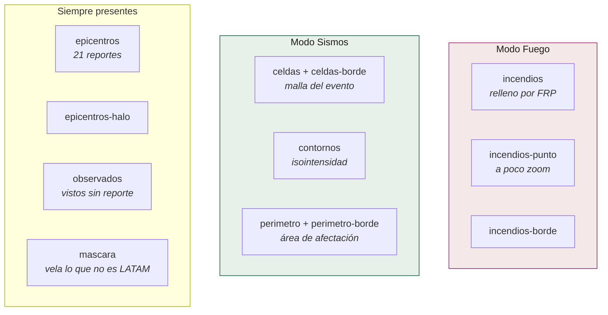
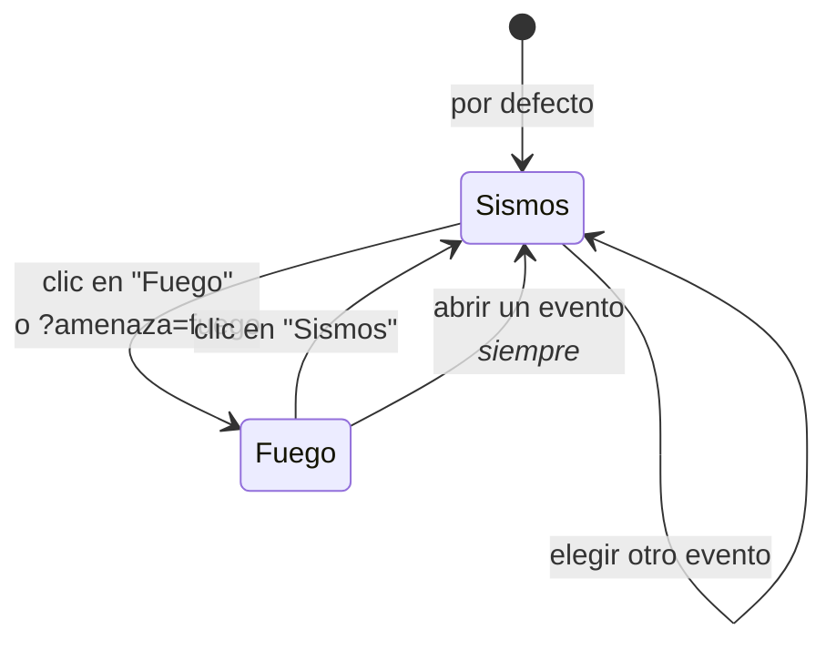

# Capas y modos

Doce capas de MapLibre gobernadas por un selector de amenaza, sobre un mapa
base que se puede cambiar.

## Las capas



| Capa | Qué dibuja |
|---|---|
| `epicentros` | Los 21 reportes. El círculo crece con la población expuesta |
| `epicentros-halo` | Halo proporcional, solo en la vista panorámica |
| `observados` | Sismos vistos y no despachados. Estrella hueca |
| `celdas` / `celdas-borde` | La malla H3 del evento abierto, coloreada por la variable elegida |
| `contornos` | Las líneas de isointensidad de ShakeMap |
| `perimetro` / `perimetro-borde` | El área de afectación, disuelta con `h3.cellsToMultiPolygon` |
| `incendios` | Celdas con foco activo, rampa de potencia radiativa |
| `incendios-punto` | La misma celda como punto, a poco zoom |
| `incendios-borde` | Contorno de la celda con fuego |
| `mascara` | El velo sobre lo que no es América Latina. Ver abajo |

## El selector de amenaza



**Abrir un evento vuelve a Sismos, venga de donde venga.** Un panel de franjas
de intensidad sobre un mapa de potencia radiativa serían dos amenazas hablando
a la vez.

### La regla de contexto, asimétrica a propósito

| En modo… | La otra amenaza |
|---|---|
| **Fuego** | Los epicentros quedan como estrellas tenues **sin etiqueta**. Veintiuno no estorban, y responden *"¿el sismo cayó donde ardía?"* |
| **Sismos** | El fuego **no se dibuja**. Cuatro mil símbolos con rampa propia no saben ser discretos |

No es una inconsistencia: es una asimetría medida. 21 marcas discretas son
contexto; 4.000 son otro mapa.

### Qué se mueve con el modo

- La **leyenda** de potencia radiativa ocupa el mismo hueco que la de
  intensidad, con el mismo marcado.
- El **interruptor de sismos menores** es del modo Sismos y se oculta en Fuego.
- **«Ver en el mapa»** de la tarjeta viva cambia de modo, no marca casillas.
- **`?amenaza=fuego`** viaja en la URL como `?evento=`, así que un modo es
  compartible. También viajan `?pais=` y `?periodo=` —y sus gemelos de fuego
  `?paisf=` y `?periodof=`—: eligen **qué** se mira, y una vista filtrada tiene
  que poderse mandar. `orden` y «solo lo que se ve en el mapa» **no** viajan a
  propósito: son preferencias de lectura, no contenido.

## El velo: por qué no se reencuadra

La caja de América Latina es **alta** —73° de ancho por 76° de alto— y el panel
del mapa es apaisado en todo escritorio. `fitBounds` encaja por la dimensión que
primero se agota, que aquí es siempre la altura, y el ancho sobrante se reparte a
los dos lados.

Medido en la página publicada antes del arreglo: **191° de longitud visibles** en
una ventana de 1540 px, con la región ocupando el **38 % del ancho útil** y
Nigeria, Argelia, Chad y Namibia rotuladas en un tablero de exposición sísmica
latinoamericana.

No hay encuadre que lo arregle. Llenar el ancho obliga a recortar latitud, y el
primer recorte que cabe se lleva Ciudad de México, Monterrey y Santiago. Entre
enseñar la región entera y llenar el ancho, **se enseña la región entera y se
apaga lo demás**: un polígono del mundo con un agujero en la región, relleno con
el tono del papel del estilo activo.

Va **encima de todo el estilo base** —símbolos incluidos, que es de donde venían
los rótulos— y **debajo de la primera capa de dato**, que es lo que comprueba
`test_la_mascara_tapa_el_mapa_base_y_no_el_dato`.

Medido después, en cinco tamaños: ninguno de los sitios con reporte queda fuera
de la vista inicial, y la región ocupa del 41 % (portátil corto) al 88 % (móvil)
del ancho.

## La simbología del fuego: la tinta tiene que caber

La vista continental era una mancha, y no por casualidad: **12.767 símbolos de
radio 3 a 5,5 px suman 413.000 px² de tinta sobre una franja útil de 335.000**,
o sea 1,23 veces el lienzo entero.

Y sin `circle-sort-key` ganaba el que viniera después en el fichero. Medido a
zoom 2: el 69 % de las celdas cae sobre un píxel ya ocupado, y **las 150 más
energéticas comparten píxel con otra sin una sola excepción**. Encima, las 5.221
celdas más débiles —≤10 MW, que juntas no llegan al 1 % de la energía— ponían
**once veces más tinta** que las 150 más fuertes.

| | tinta | vs. lienzo | radio | débiles : fuertes |
|---|---:|---:|---|---:|
| antes | 413 mil px² | 1,23× | 3,0 → 5,5 px | 10,9 : 1 |
| ahora | **117 mil px²** | **0,15×** | 0,8 → 7,8 px | **2,0 : 1** |

Tres propiedades, y cada una su razón:

1. **`circle-sort-key` por FRP.** El fuego fuerte se dibuja encima.
2. **Radio por raíz del FRP, con suelo de 0,8 px.** El *área* del círculo sigue a
   la energía, que es como se escala un símbolo proporcional. Una celda débil pasa
   a ser polvo: sigue estando y deja de competir.
3. **Contorno solo desde zoom 7.** Con radio 2 px el contorno **es** el símbolo:
   se come el relleno —que es lo que lleva el color— y los contornos solapados
   tejen la malla oscura que se veía. De cerca sigue separando los que se tocan.

`window.CENTINELA.tintaDelFuego(zoom)` mide esto evaluando **la expresión que la
capa tiene puesta**, no una copia: si alguien cambia la simbología, la medida le
sigue.

### Lo que se probó y se descartó

| Alternativa | Por qué no |
|---|---|
| **Cluster por conteo** | Los conteos flotan sobre el mar: el centroide de una región de fuego en media luna cae en el Pacífico. Y «2.7k» se lee como 2.700 incendios cuando son celdas de detección |
| **Cluster por energía sumada** | Peor: satura en la clase alta en todas partes y tapa el continente |
| **Bin H3 a r5** | Subpíxel a zoom 2. A r3 se ve, pero sumar FRP confunde un incendio de 2.400 MW con doscientos de diez |
| **Mapa de calor** | Medido: con `heatmap-intensity` y `heatmap-radius` **fijos**, el mismo punto sale `rgb(183,39,78)` a zoom 2, `rgb(238,113,21)` a zoom 4 y del color del papel a zoom 6. `heatmap-density` cuenta vecinos por píxel de pantalla, no energía: **no se puede rotular en MW** |

## Los dos widgets del mapa

Van en un **solo** `maplibregl-ctrl-group`: cada grupo trae 10 px de margen
propio, y la esquina de arriba a la derecha es la única libre.

- **Inicio.** Devuelve el encuadre de la región. `volverAlEncuadre` existía desde
  siempre y solo lo llamaba `cerrarDetalle`, así que en modo panorama era
  inalcanzable.
- **Mapa base.** Tres estilos de OpenFreeMap, de los cinco que publica:

| Opción | Estilo | Por qué |
|---|---|---|
| **Claro** *(defecto)* | `positron` | El único contra el que están medidos los contrastes de las dos rampas. Se retinta a la paleta de la identidad |
| **Oscuro** | `dark` | Para pantallas a media luz; el fuego gana contraste |
| **Con relieve** | `bright` | Más detalle de terreno, a costa de que el mapa compita con el dato — y la galería lo dice |

`liberty` y `fiord` quedan fuera: son de colores saturados y sobre ellos las dos
rampas dejan de leerse. Ofrecer un mapa base que estropea el dato no es dar una
opción, es dar una trampa.

> **`setStyle` no cambia el fondo: tira el estilo entero**, y con él todas las
> fuentes y todas las capas, incluidas las nuestras. El cambio pasa por
> `cambiarEstiloBase`, que repone el dato y vuelve a seleccionar el evento
> abierto. Y **`setStyle` no emite `style.load`** (MapLibre 4.7.1: solo `data`,
> `styledata` e `idle`), así que la preparación del estilo escucha `styledata`
> **e** `idle`.

En pantalla estrecha desaparecen los botones de zoom: son los únicos tres
controles con gesto equivalente —el propio aviso de gestos cooperativos dice
«usa dos dedos»—. Hacía falta: con un evento abierto en 390 px la barra de escala
caía 67 px dentro de la leyenda, y ya se metía 22 px antes de añadir nada.

## La rueda no es del mapa

`cooperativeGestures: true`. El mapa vive a media pantalla de un documento que
sigue hacia abajo, y bajar a leer pasaba la rueda por encima del mapa: medido, un
solo gesto de tres clics movía el zoom de 2,05 a 1,65 **y** la página 300 px. Se
llegaba a ver China y Etiopía en un tablero de América Latina.

## Los topónimos, en español

Positron rotula con `name`, que es el topónimo local: «Gulf of Mexico»,
«Democratic Republic of the Congo», y Libia en árabe. `rotularEnEspanol`
sustituye el `text-field` por
`["coalesce", ["get","name:es"], ["get","name:latin"], ["get","name"]]` en las
capas cuyo campo ya menciona `name` — los escudos de carretera rotulan con `ref`
y cambiarlos los dejaría en blanco.

## La leyenda de fuego dice lo que el mapa dibuja

> Energía medida por satélite en 24 h. No es área quemada: el propio FIRMS
> desaconseja estimarla desde detecciones. A escala continental el círculo crece
> con la raíz de esa energía, así que su área la sigue de frente: un punto
> pequeño es una detección débil, no una lejana.

Esa última frase es un contrato con el pipeline. Durante un tiempo el visor
decía *"las 4.000 celdas de mayor energía"* y era **falso**: `_prioridad`
publica primero las pobladas. Hoy hay una prueba de navegador
(`test_el_modo_fuego_promete_lo_que_dibuja`) que compara el rótulo con el
criterio real.

## La instrumentación

```js
window.CENTINELA.pintado  // { epicentros: {rasgos: 21}, incendios: {rasgos: 4000}, … }
window.CENTINELA.errores  // []
```

Es una superficie pública deliberada. Las pruebas de navegador leen de ahí y no
de una captura de pantalla, porque una pestaña que corre oculta congela
`requestAnimationFrame` y el mapa parece vacío cuando no lo está.

## Detalles que costaron una regresión

- **El perímetro se pinta con tinta oscura y funda blanca**, no con el color de
  su banda: sobre su propio relleno era invisible.
- **`fitBounds` en `load` no puede pisar** el vuelo hacia un evento
  profundo-enlazado. `if (estado.seleccionado) return;`.
- **`aplicarAmenaza()` no lleva `isStyleLoaded()` de guardia**: durante la carga
  inicial es `false` mientras llegan teselas, y el enlace profundo a Fuego
  pasaba justo entonces — los *paints* se saltaban y los epicentros quedaban a
  toda opacidad sobre el fuego.
- **`[hidden]` pierde contra `display: flex` de clase.** Ha mordido tres veces
  en este repositorio. Cada elemento que se oculta por atributo necesita su
  regla `.clase[hidden] { display: none }`.
