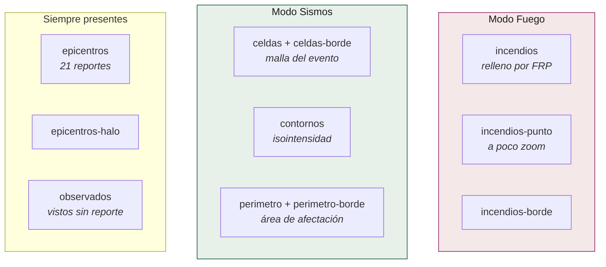
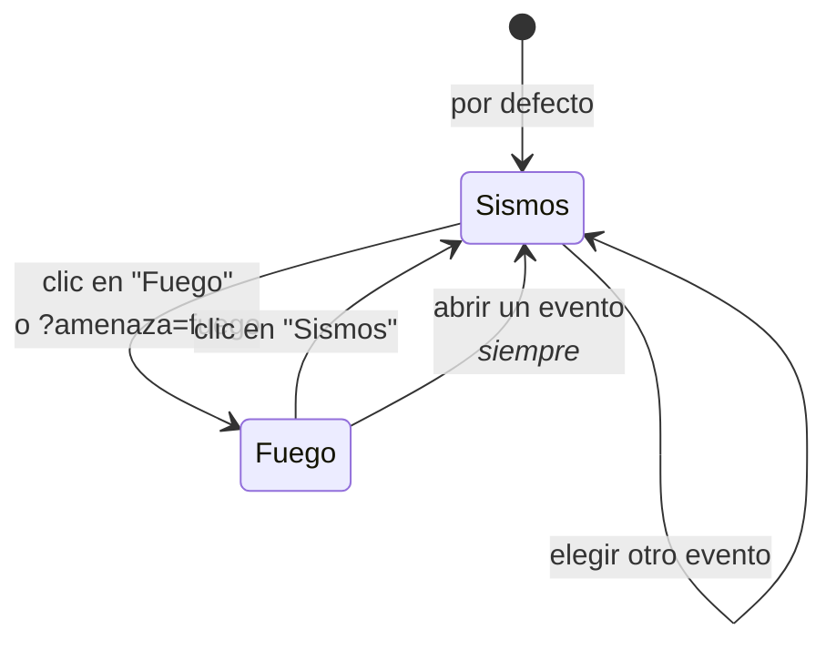

# Capas y modos

Once capas de MapLibre gobernadas por un selector de amenaza.

## Las capas



| Capa | Qué dibuja |
|---|---|
| `epicentros` | Los 21 reportes. El círculo crece con la población expuesta |
| `epicentros-halo` | Halo proporcional, sólo en la vista panorámica |
| `observados` | Sismos vistos y no despachados. Estrella hueca |
| `celdas` / `celdas-borde` | La malla H3 del evento abierto, coloreada por la variable elegida |
| `contornos` | Las líneas de isointensidad de ShakeMap |
| `perimetro` / `perimetro-borde` | El área de afectación, disuelta con `h3.cellsToMultiPolygon` |
| `incendios` | Celdas con foco activo, rampa de potencia radiativa |
| `incendios-punto` | La misma celda como punto, a poco zoom |
| `incendios-borde` | Contorno de la celda con fuego |

## El selector de amenaza



**Abrir un evento vuelve a Sismos, venga de donde venga.** Un panel de franjas
de intensidad sobre un mapa de potencia radiativa serían dos amenazas hablando
a la vez.

### La regla de contexto, asimétrica a propósito

| En modo… | La otra amenaza |
|---|---|
| **Fuego** | Los epicentros quedan como estrellas tenues **sin etiqueta**. Veintiuno no estorban, y responden *"¿el sismo cayó donde ardía?"* |
| **Sismos** | El fuego **no se dibuja**. Cuatro mil símbolos con rampa propia no saben ser discretos |

No es una inconsistencia: es una asimetría medida. 21 marcas discretas son
contexto; 4.000 son otro mapa.

### Qué se mueve con el modo

- La **leyenda** de potencia radiativa ocupa el mismo hueco que la de
  intensidad, con el mismo marcado.
- El **interruptor de sismos menores** es del modo Sismos y se oculta en Fuego.
- **«Ver en el mapa»** de la tarjeta viva cambia de modo, no marca casillas.
- **`?amenaza=fuego`** viaja en la URL como `?evento=`, así que un modo es
  compartible.

## La leyenda de fuego dice lo que el mapa dibuja

> Energía medida por satélite en 24 h. No es área quemada: el propio FIRMS
> desaconseja estimarla desde detecciones. Se dibujan **4.000 de 13.145 celdas:
> primero las que tienen gente debajo**, el resto por potencia.

Esa última frase es un contrato con el pipeline. Durante un tiempo el visor
decía *"las 4.000 celdas de mayor energía"* y era **falso**: `_prioridad`
publica primero las pobladas. Hoy hay una prueba de navegador
(`test_el_modo_fuego_promete_lo_que_dibuja`) que compara el rótulo con el
criterio real.

## La instrumentación

```js
window.CENTINELA.pintado  // { epicentros: {rasgos: 21}, incendios: {rasgos: 4000}, … }
window.CENTINELA.errores  // []
```

Es una superficie pública deliberada. Las pruebas de navegador leen de ahí y no
de una captura de pantalla, porque una pestaña que corre oculta congela
`requestAnimationFrame` y el mapa parece vacío cuando no lo está.

## Detalles que costaron una regresión

- **El perímetro se pinta con tinta oscura y funda blanca**, no con el color de
  su banda: sobre su propio relleno era invisible.
- **`fitBounds` en `load` no puede pisar** el vuelo hacia un evento
  profundo-enlazado. `if (estado.seleccionado) return;`.
- **`aplicarAmenaza()` no lleva `isStyleLoaded()` de guardia**: durante la carga
  inicial es `false` mientras llegan teselas, y el enlace profundo a Fuego
  pasaba justo entonces — los *paints* se saltaban y los epicentros quedaban a
  toda opacidad sobre el fuego.
- **`[hidden]` pierde contra `display: flex` de clase.** Ha mordido tres veces
  en este repositorio. Cada elemento que se oculta por atributo necesita su
  regla `.clase[hidden] { display: none }`.
