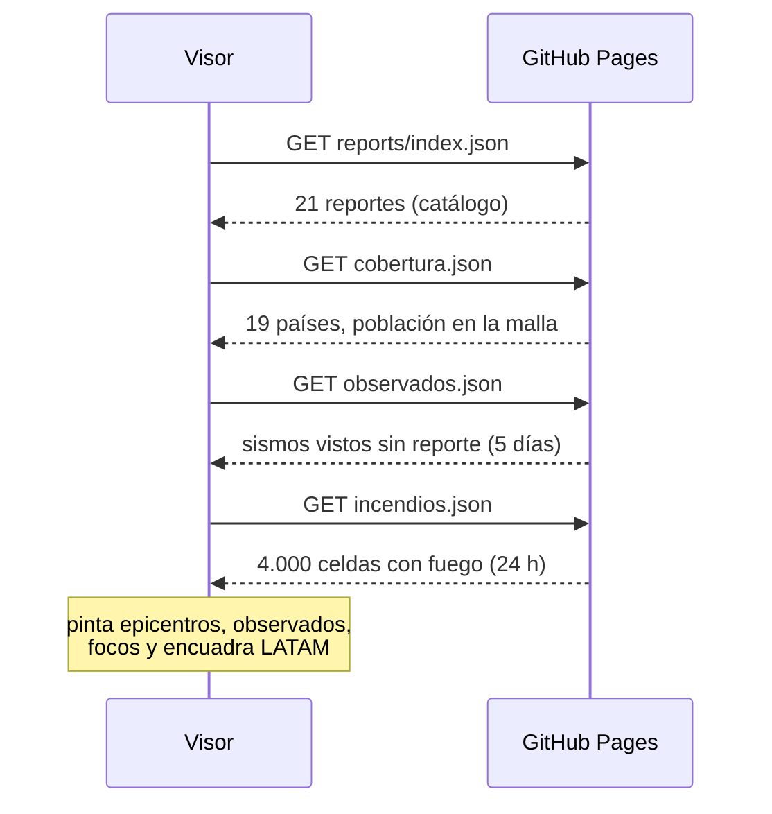
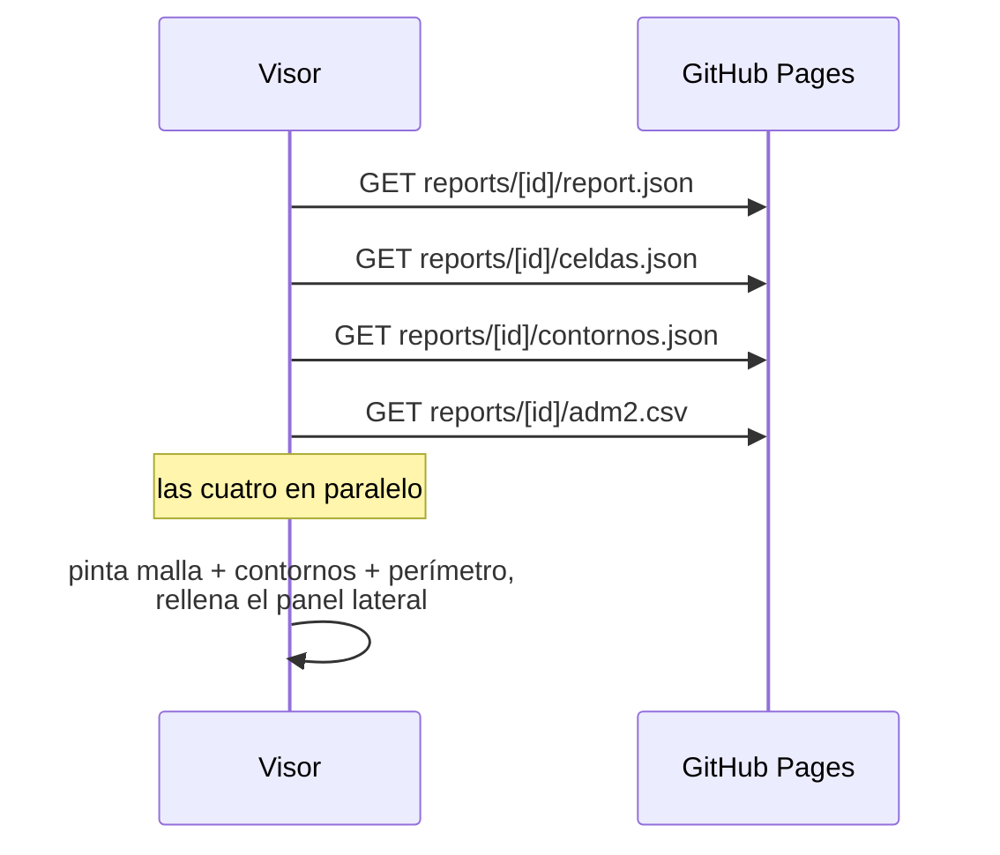
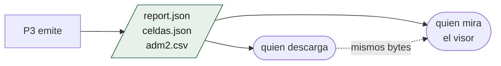

# Qué consume el visor

Todo por `fetch` a rutas del propio repositorio. Ni una llamada a un servicio
de terceros que devuelva datos del sistema.

## Al abrir

| Fichero | Qué alimenta |
|---|---|
| `reports/index.json` | El selector de eventos y las estrellas del mapa |
| `cobertura.json` | La tabla de países y el filtro por país |
| `observados.json` | Las estrellas huecas: *visto, sin reporte* |
| `incendios.json` | El modo Fuego completo: celdas, leyenda y tarjeta viva |

## Al elegir un evento

| Fichero | Qué alimenta | Si falta |
|---|---|---|
| `report.json` | Panel lateral: totales, incertidumbre, descargas | El evento no se puede abrir |
| `celdas.json` | La malla H3 coloreada por variable | Se pinta sin malla (reporte antiguo) |
| `contornos.json` | Las líneas de isointensidad | Se pinta sin contornos |
| `adm2.csv` | La tabla de municipios | Tabla vacía |

**Los tres últimos se degradan solos.** Un reporte anterior a `celdas.json` no
trae malla, y un preliminar no tiene contornos: el visor los pide con
`.then(r => r.ok ? … : null)` y sigue. Un artefacto que no existe no puede
tumbar la vista de uno que sí.

## Las siete variables de la malla

Cada pestaña del visor es **una columna de `celdas.json`, que es una columna
del activo**:

| Pestaña | Columna |
|---|---|
| Intensidad | `mmi` |
| Población | `pop_total` |
| Edificaciones | `bld_count` |
| Superficie construida | `built_m2` |
| Vías | `road_km_*` |
| Salud | `health_count` |
| Educación | `edu_count` |

No hay cálculo en el navegador: el visor colorea lo que el pipeline ya midió.

## El principio de no divergencia

El botón "descargar" del panel lateral apunta **a los mismos ficheros que el
visor acaba de pintar**. No hay una capa de presentación que reformatee cifras
por su cuenta: si el visor dice 2.424.287, ese número está literalmente en el
JSON que se descarga.

La única transformación que hace el visor es de **formato**, no de valor:
separadores de millar en español, redondeo en las barras de porcentaje, y la
conversión de celda H3 a polígono con `h3-js` para dibujarla.

## Lo que se calcula en el navegador

Poco, y todo geométrico:

- `h3.cellsToMultiPolygon` — disuelve las celdas del evento en un perímetro.
- `h3.cellToBoundary` — convierte cada celda en su hexágono.
- El área de cada banda, multiplicando celdas por `AREA_CELDA_KM2 = 5.2`.
- Qué reportes caen dentro del encuadre actual, para la lista lateral.

Nada de eso produce una cifra nueva sobre la exposición: son operaciones de
dibujo y de navegación.
