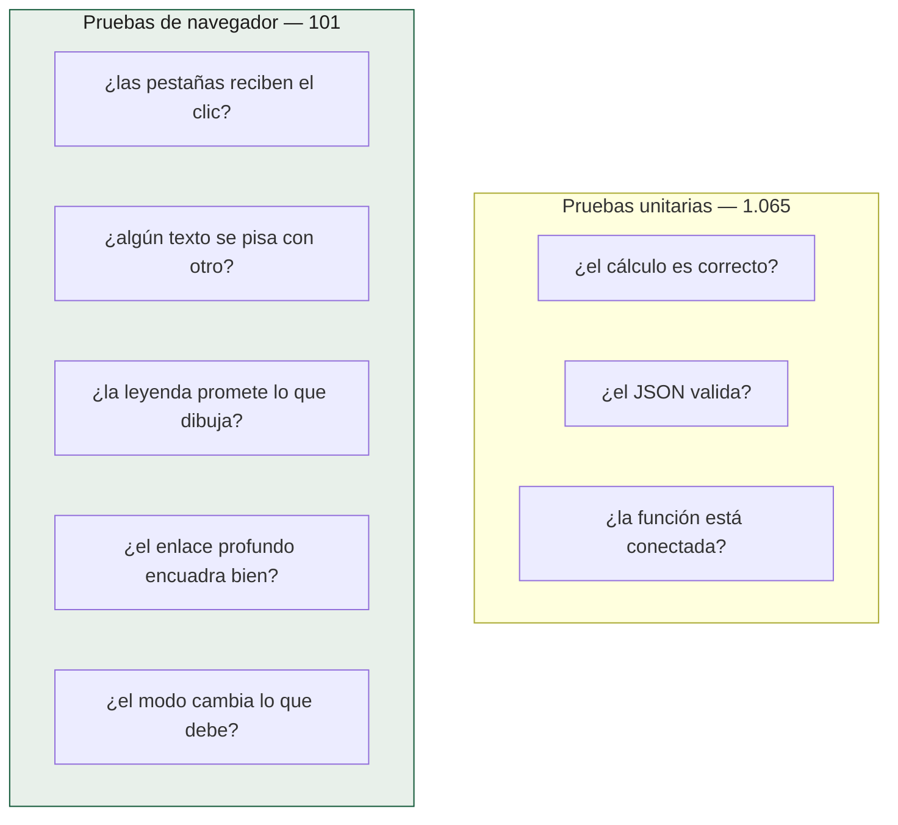

# Validar el visor

101 pruebas de Playwright que abren el visor en un Chromium de verdad.

```bash
uv run --extra dev --extra visor pytest tests/visor -m visor
```

Corren en CI (`visor.yml`) en cada push y PR.

## Qué comprueban que ninguna prueba unitaria puede



Ejemplos de fallos que **sólo** el navegador encontró:

- Una tarjeta de capas que creció a 576 px y tapó las pestañas.
- La barra de escala "2000 km" pisando el título de la leyenda en móvil.
- `maplibre-gl.css` declarando `z-index: 2` y ganándole a la regla propia.
- El selector `> * + *` (0,1,0) perdiendo contra `border: 0` (0,2,0).
- Las opciones del selector de mapa base aplastadas en cuadrados de 29 px:
  `.maplibregl-ctrl-group button` gana por especificidad a una sola clase.

Y dos trampas del propio banco de pruebas, que se pagaron dos veces cada una:

- **Recortar el código por un número fijo de caracteres.** Dos pruebas leían 900
  caracteres desde el id de una capa; al documentar la simbología el bloque
  creció y las aserciones quedaron fuera, **pasando en verde sobre código que ya
  no miraban**. Se delimita por la capa siguiente.
- **Buscar «hay un globo abierto».** El rótulo que sale al pasar por encima de un
  epicentro también es un `.maplibregl-popup`, así que una prueba del globo de
  celda lo daba por bueno y fallaba después por la razón equivocada. Se busca la
  clase del globo concreto.

## La instrumentación, no la captura

Las pruebas leen `window.CENTINELA.pintado`, un registro público de qué capas
se pintaron y con cuántos rasgos:

```python
_esperar_capa(pagina, "incendios")  # espera a que el registro lo confirme
```

**Nunca se mide desde una captura de pantalla.** Una pestaña que corre en
segundo plano tiene `visibilityState: hidden`, y entonces
`requestAnimationFrame` se congela: MapLibre **no llega a disparar `load`**, así
que no se aplica el encuadre, no se quita el aviso de «cargando» y las capas
parecen no pintarse.

Reglas que se derivan de eso:

1. La verdad está en `window.CENTINELA`, no en el píxel.
2. **Nunca** medir rendimiento ni estados `:focus` en una pestaña oculta.
3. Para *ver* el mapa —juzgar cartografía, no comprobar estado— hay que renderizar
   de verdad: un script de Playwright que copie `site/` y `reports/` a un temporal
   como hace el fixture `_sitio`, lo sirva y capture. Pelearse con una pestaña
   oculta no lleva a ninguna parte.

## La superficie pública

`window.CENTINELA` no es un gancho de pruebas: es el visor rindiendo cuentas, y
sirve igual para diagnosticar desde la consola de quien reporte un fallo.

| Sonda | Responde |
|---|---|
| `pintado` | Qué capas se pintaron y con cuántos rasgos |
| `errores` | Lo que falló al dibujar, sin tener que mirar la consola |
| `camara` | La última orden dada a la cámara, y por qué |
| `encuadre()` | Qué caja está enseñando el mapa |
| `capasDelMapa()` | Los ids del estilo **en orden de dibujo** |
| `rotulosEnEspanol()` | Cuántas capas de rótulos hablan español y cuántas no |
| `tintaDelFuego(zoom)` | Cuánta pantalla cubren los círculos de fuego, contra la que hay |
| `ordenDeDibujo(capa)` | Por qué se apilan los símbolos de una capa |
| `filtroDeCapa(capa)` | Qué filtro tiene puesto MapLibre |
| `totalesDelTablero()` / `sumaDelVisor()` | Dos implementaciones de la misma suma, para poder compararlas |
| `abrirFoco(i)` / `olvidarElViento()` | Puertas para provocar estados que no se dan solos |

Las dos últimas existen por una regla: **una prueba que sólo pasa porque el
escenario no ocurre no vigila nada**. Los 3.337 puntos de la rejilla de viento
cubren hoy los 6.239 focos, así que el caso «GFS no llegó» hay que provocarlo.

## La sonda de solapes

`SONDA_SOLAPES` recorre los elementos de texto visibles, mide sus cajas y
falla si dos se pisan. Corre en los tres tamaños y **en los dos modos**:

```python
assert solapes == [], f"en {etiqueta} ({ancho}x{alto}), modo sismos: {solapes}"
# … cambiar a modo fuego …
assert solapes == [], f"en {etiqueta} ({ancho}x{alto}), modo fuego: {solapes}"
```

Es la prueba que encontró que la escala pisaba la leyenda: un fallo que una
persona ve en dos segundos y que ninguna aserción sobre el DOM detecta.

## Reproducir carreras de red

Un fallo que sólo aparece con red lenta no se reproduce en un servidor local,
que responde en microsegundos. Se retrasan **las teselas**, no el estilo:

```python
pg.route("**/tiles.openfreemap.org/**/*.pbf", _lento)  # 1,2 s
```

Retrasar el estilo no sirve: en local `load` llega antes que `styledata` y la
carrera no existe. Con las teselas lentas, sí — y así se reprodujo la
regresión del enlace profundo que reportaba "21 de 21 reportes en el encuadre".

## Un aviso para quien valide a mano

`inner_text()` devuelve el texto **renderizado**, con las versalitas aplicadas:
`"CARGANDO EL MAPA"`, no `"Cargando el mapa"`. Ha mordido tres veces. Comparar
siempre en minúsculas.
